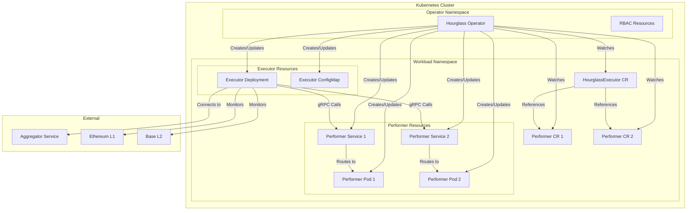
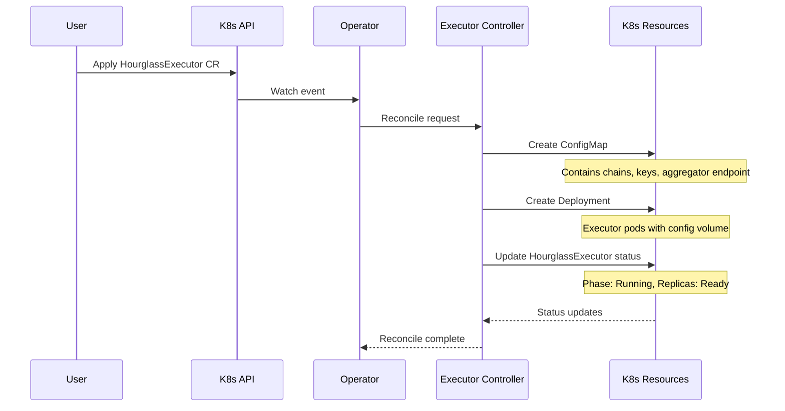
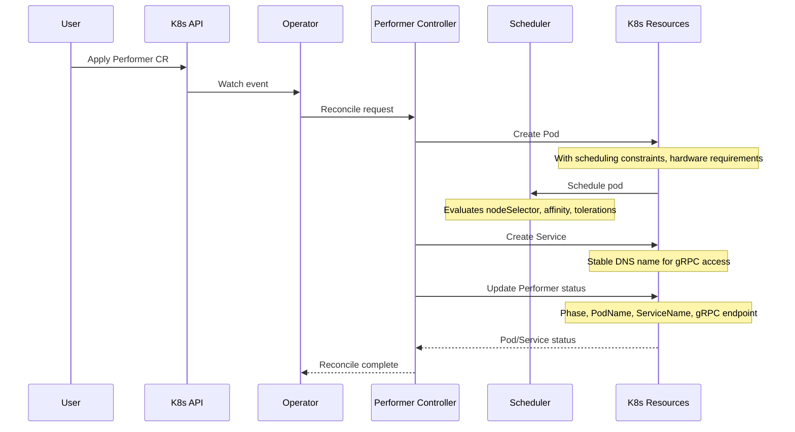

# Hourglass Kubernetes Operator

The Hourglass Kubernetes Operator is a custom controller that manages the lifecycle of Hourglass Executors and Performers in Kubernetes clusters. It enables scalable, secure execution of AVS (Actively Validated Services) workloads with advanced scheduling and hardware requirements.

## Overview

The operator extends Kubernetes with two custom resources:
- **HourglassExecutor**: Manages the aggregation and execution layer
- **Performer**: Manages individual AVS workload containers

## Architecture



## Process Flows

### Executor Deployment Flow



### Performer Deployment Flow



## Key Features

### Advanced Scheduling

- **Node Selection**: Target specific node types (e.g., Bottlerocket, GPU nodes)
- **Affinity Rules**: Required and preferred node placement
- **Tolerations**: Run on tainted nodes for specialized hardware
- **Runtime Classes**: Support for gVisor, Kata Containers, etc.

### Hardware Requirements

- **GPU Support**: Nvidia GPU allocation with specific types
- **TEE Support**: Trusted Execution Environment requirements (SGX, SEV, TDX)
- **Custom Labels**: Flexible hardware matching via labels

### Service Discovery

- **Stable DNS Names**: Predictable service naming for executor connections
- **gRPC Endpoints**: Auto-generated endpoints for performer communication
- **Service Mesh Ready**: Compatible with Istio, Linkerd service meshes

## Custom Resources

### HourglassExecutor

Manages the executor component that coordinates tasks across multiple chains and performers.

```yaml
apiVersion: hourglass.eigenlayer.io/v1alpha1
kind: HourglassExecutor
metadata:
  name: example-executor
spec:
  image: "hourglass/executor:v1.0.0"
  replicas: 2
  config:
    aggregatorEndpoint: "aggregator.hourglass.io:9090"
    performerMode: "kubernetes"
    logLevel: "info"
    chains:
    - name: "ethereum"
      rpc: "https://eth-mainnet.alchemyapi.io/v2/..."
      chainId: 1
      taskMailboxAddress: "0x..."
    - name: "base"
      rpc: "https://base-mainnet.infura.io/v3/..."
      chainId: 8453
      taskMailboxAddress: "0x..."
    operatorKeys:
      ecdsa: "0x..."
      bls: "0x..."
  resources:
    requests:
      cpu: "500m"
      memory: "1Gi"
    limits:
      cpu: "2"
      memory: "4Gi"
```

### Performer

Manages individual AVS workload containers with specialized scheduling and hardware requirements.

```yaml
apiVersion: hourglass.eigenlayer.io/v1alpha1
kind: Performer
metadata:
  name: example-performer
spec:
  avsAddress: "0x1234567890abcdef..."
  image: "myavs/performer:v2.1.0"
  version: "v2.1.0"
  config:
    grpcPort: 9090
    environment:
      LOG_LEVEL: "debug"
      CHAIN_ID: "1"
  resources:
    requests:
      cpu: "1"
      memory: "2Gi"
    limits:
      cpu: "4"
      memory: "8Gi"
  scheduling:
    nodeSelector:
      node.kubernetes.io/instance-type: "m5.2xlarge"
    tolerations:
    - key: "dedicated"
      operator: "Equal"
      value: "avs-workloads"
      effect: "NoSchedule"
  hardwareRequirements:
    gpuType: "nvidia-a100"
    gpuCount: 1
    teeRequired: true
    teeType: "sgx"
```

## Deployment

### Prerequisites

- Kubernetes cluster v1.24+
- RBAC permissions for custom resources
- Container runtime with GPU support (if using GPU requirements)

### Install the Operator

```bash
# Apply CRDs
kubectl apply -f config/crd/bases/

# Apply RBAC
kubectl apply -f config/rbac/

# Deploy operator
kubectl apply -f config/operator/
```

### Deploy an Executor

```bash
# Create executor instance
kubectl apply -f examples/executor.yaml

# Check status
kubectl get hourglassexecutors
kubectl describe hourglassexecutor example-executor
```

### Deploy Performers

```bash
# Create performer instances
kubectl apply -f examples/performer-gpu.yaml
kubectl apply -f examples/performer-tee.yaml

# Check status
kubectl get performers
kubectl describe performer example-performer
```

## Monitoring

### Operator Health

```bash
# Check operator logs
kubectl logs -n hourglass-operator-system deployment/hourglass-operator-controller-manager

# Monitor resource status
kubectl get hourglassexecutors,performers --all-namespaces
```

### Resource Status

The operator maintains detailed status information:

**HourglassExecutor Status:**
- `phase`: Current deployment phase (Pending/Running/Stopped)
- `replicas`: Total and ready replica counts
- `lastConfigUpdate`: Timestamp of last configuration change

**Performer Status:**
- `phase`: Current lifecycle phase (Pending/Running/Upgrading/Terminating/Failed)
- `podName`: Associated pod name
- `serviceName`: Associated service name
- `grpcEndpoint`: Full DNS name for gRPC connections
- `readyTime`: When the performer became ready

## Troubleshooting

### Common Issues

**Executor Not Starting:**
```bash
# Check deployment status
kubectl describe deployment <executor-name>

# Check pod logs
kubectl logs deployment/<executor-name>

# Verify configuration
kubectl describe configmap <executor-name>-config
```

**Performer Scheduling Issues:**
```bash
# Check scheduling constraints
kubectl describe performer <performer-name>

# Check node compatibility
kubectl get nodes --show-labels

# Check pod events
kubectl describe pod <performer-pod-name>
```

**Service Discovery Problems:**
```bash
# Verify service creation
kubectl get services

# Test DNS resolution
kubectl run -it --rm debug --image=busybox --restart=Never -- nslookup <service-name>

# Check endpoint readiness
kubectl get endpoints <service-name>
```

## Development

### Building the Operator

```bash
# Build binary
make build

# Build container image
make docker-build

# Run tests
make test

# Generate manifests
make manifests
```

### Adding New Features

The operator follows standard Kubernetes controller patterns:

1. Define new fields in CRD types (`api/v1alpha1/`)
2. Implement controller logic (`internal/controller/`)
3. Update RBAC permissions
4. Generate manifests (`make manifests`)
5. Add tests and documentation

## Security Considerations

### RBAC

The operator requires minimal permissions:
- Manage custom resources (hourglassexecutors, performers)
- Manage core resources (pods, services, configmaps, deployments)
- Read-only access to nodes for scheduling

### Pod Security

- Supports Pod Security Standards
- Configurable security contexts
- Resource limits and requests enforcement
- Network policy compatibility

### Secret Management

- Operator keys stored in Kubernetes secrets
- ConfigMap separation for non-sensitive data
- Support for external secret management systems

## Future Enhancements

- [ ] Horizontal Pod Autoscaler integration
- [ ] Custom metrics for scaling decisions
- [ ] Blue-green deployment strategies
- [ ] Multi-cluster support
- [ ] Operator metrics and alerting
- [ ] Admission webhooks for validation