# Hourglass Kubernetes Operator

The Hourglass Kubernetes Operator is a **singleton controller** that manages the lifecycle of AVS Performers in Kubernetes clusters. It enables scalable, secure execution of AVS (Actively Validated Services) workloads with advanced scheduling and hardware requirements, while allowing users to independently deploy and manage their Hourglass Executors.

## Overview

The operator extends Kubernetes with a single custom resource:
- **Performer**: Manages individual AVS workload containers with advanced scheduling and hardware requirements

**Key Architecture Principle**: The operator implements a **singleton pattern** where one operator instance can serve multiple independently deployed Hourglass Executors across the cluster.

## Architecture

```mermaid
graph TB
    subgraph "Kubernetes Cluster"
        subgraph "hourglass-system Namespace"
            OP[Hourglass Operator<br/>🔹 Singleton Instance]
            RBAC[RBAC Resources<br/>🔹 Cluster-wide Permissions]
        end
        
        subgraph "AVS-A Namespace"
            E1[User-Deployed<br/>Executor StatefulSet A]
            P1[Performer CR A1]
            P2[Performer CR A2]
            
            subgraph "Performer Resources A"
                PP1[Performer Pod A1]
                PS1[Performer Service A1]
                PP2[Performer Pod A2] 
                PS2[Performer Service A2]
            end
        end
        
        subgraph "AVS-B Namespace"
            E2[User-Deployed<br/>Executor StatefulSet B]
            P3[Performer CR B1]
            
            subgraph "Performer Resources B"
                PP3[Performer Pod B1]
                PS3[Performer Service B1]
            end
        end
    end
    
    subgraph "External"
        AGG[Aggregator Service]
        CHAIN1[Ethereum L1]
        CHAIN2[Base L2]
    end
    
    OP -->|Watches All| P1
    OP -->|Watches All| P2
    OP -->|Watches All| P3
    
    OP -->|Creates/Updates| PP1
    OP -->|Creates/Updates| PS1
    OP -->|Creates/Updates| PP2
    OP -->|Creates/Updates| PS2
    OP -->|Creates/Updates| PP3
    OP -->|Creates/Updates| PS3
    
    E1 -->|Creates| P1
    E1 -->|Creates| P2
    E2 -->|Creates| P3
    
    E1 -->|Connects to| AGG
    E1 -->|Monitors| CHAIN1
    E1 -->|Monitors| CHAIN2
    E1 -->|gRPC Calls| PS1
    E1 -->|gRPC Calls| PS2
    
    E2 -->|Connects to| AGG
    E2 -->|Monitors| CHAIN1
    E2 -->|Monitors| CHAIN2
    E2 -->|gRPC Calls| PS3
    
    PS1 -->|Routes to| PP1
    PS2 -->|Routes to| PP2
    PS3 -->|Routes to| PP3
```



## Process Flows

### Operator Deployment Flow


### User Executor + Performer Deployment Flow


## Key Features

### Singleton Architecture Benefits

- **Single Operator Instance**: One operator serves multiple Executors across the cluster
- **User-Managed Executors**: Users deploy Executors as StatefulSets with full control
- **Namespace Isolation**: Different AVS deployments can be isolated in separate namespaces
- **Resource Efficiency**: Minimal cluster overhead with centralized performer management
- **Scalability**: Operator scales to handle hundreds of performers across multiple AVS projects

### Advanced Scheduling

- **Node Selection**: Target specific node types (e.g., Bottlerocket, GPU nodes)
- **Affinity Rules**: Required and preferred node placement
- **Tolerations**: Run on tainted nodes for specialized hardware
- **Runtime Classes**: Support for gVisor, Kata Containers, etc.

### Hardware Requirements

- **GPU Support**: Nvidia GPU allocation with specific types
- **TEE Support**: Trusted Execution Environment requirements (SGX, SEV, TDX)
- **Custom Labels**: Flexible hardware matching via labels

### Service Discovery

- **Stable DNS Names**: Predictable service naming for executor connections
- **Pattern**: `performer-{name}.{namespace}.svc.cluster.local`
- **gRPC Endpoints**: Auto-generated endpoints for performer communication
- **Service Mesh Ready**: Compatible with Istio, Linkerd service meshes

## Custom Resources

### Performer

Manages individual AVS workload containers with specialized scheduling and hardware requirements.

```yaml
apiVersion: hourglass.eigenlayer.io/v1alpha1
kind: Performer
metadata:
  name: example-performer
  namespace: avs-project-a
spec:
  avsAddress: "0x1234567890abcdef..."
  image: "myavs/performer:v2.1.0"
  version: "v2.1.0"
  config:
    grpcPort: 9090
    environment:
      LOG_LEVEL: "debug"
      CHAIN_ID: "1"
    args:
      - "--enable-metrics"
      - "--metrics-port=8080"
  resources:
    requests:
      cpu: "1"
      memory: "2Gi"
    limits:
      cpu: "4"
      memory: "8Gi"
  scheduling:
    nodeSelector:
      node.kubernetes.io/instance-type: "m5.2xlarge"
    tolerations:
    - key: "dedicated"
      operator: "Equal"
      value: "avs-workloads"
      effect: "NoSchedule"
    affinity:
      nodeAffinity:
        requiredDuringSchedulingIgnoredDuringExecution:
          nodeSelectorTerms:
          - matchExpressions:
            - key: "hardware-type"
              operator: In
              values: ["gpu", "tee"]
    runtimeClass: "gvisor"
    priorityClassName: "high-priority"
  hardwareRequirements:
    gpuType: "nvidia-a100"
    gpuCount: 1
    teeRequired: true
    teeType: "sgx"
    customLabels:
      sgx.intel.com/epc: "128Mi"
  imagePullSecrets:
  - name: myregistry-secret
```

## Deployment

### Prerequisites

- Kubernetes cluster v1.24+
- RBAC permissions for custom resources
- Container runtime with GPU support (if using GPU requirements)

### Install the Singleton Operator

```bash
# Apply CRDs
kubectl apply -f config/crd/bases/

# Apply RBAC (cluster-wide permissions)
kubectl apply -f config/rbac/

# Deploy singleton operator
kubectl apply -f config/operator/

# Verify operator is running
kubectl get pods -n hourglass-system
```

### Deploy Your Executor (User-Managed)

Users deploy their own Executor StatefulSets independently:

```yaml
# executor-statefulset.yaml
apiVersion: apps/v1
kind: StatefulSet
metadata:
  name: my-avs-executor
  namespace: my-avs-project
spec:
  serviceName: my-avs-executor
  replicas: 1
  selector:
    matchLabels:
      app: my-avs-executor
  template:
    metadata:
      labels:
        app: my-avs-executor
    spec:
      containers:
      - name: executor
        image: hourglass/executor:v1.2.0
        env:
        - name: DEPLOYMENT_MODE
          value: "kubernetes"
        - name: KUBERNETES_NAMESPACE
          value: "my-avs-project"
        - name: AGGREGATOR_ENDPOINT
          value: "aggregator.myavs.io:9090"
        volumeMounts:
        - name: config
          mountPath: /etc/executor
        - name: data
          mountPath: /data
      volumes:
      - name: config
        configMap:
          name: executor-config
  volumeClaimTemplates:
  - metadata:
      name: data
    spec:
      accessModes: ["ReadWriteOnce"]
      resources:
        requests:
          storage: 10Gi
```

```bash
# Deploy your executor
kubectl apply -f executor-statefulset.yaml

# Check executor status
kubectl get statefulsets -n my-avs-project
kubectl logs statefulset/my-avs-executor -n my-avs-project
```

### Monitor Performers

```bash
# Check all performers across cluster
kubectl get performers --all-namespaces

# Check performers in specific namespace
kubectl get performers -n my-avs-project

# Describe specific performer
kubectl describe performer example-performer -n my-avs-project
```

## Monitoring

### Operator Health

```bash
# Check singleton operator logs
kubectl logs -n hourglass-system deployment/hourglass-operator-controller-manager

# Monitor performer resources cluster-wide
kubectl get performers --all-namespaces -o wide

# Check operator resource usage
kubectl top pods -n hourglass-system
```

### Resource Status

The operator maintains detailed status information for Performers:

**Performer Status:**
- `phase`: Current lifecycle phase (Pending/Running/Upgrading/Terminating/Failed)
- `podName`: Associated pod name
- `serviceName`: Associated service name  
- `grpcEndpoint`: Full DNS name for gRPC connections (e.g., `performer-example.my-avs-project.svc.cluster.local:9090`)
- `readyTime`: When the performer became ready
- `conditions`: Detailed condition history

```bash
# Check performer status
kubectl get performers -o jsonpath='{range .items[*]}{.metadata.name}{"\t"}{.status.phase}{"\t"}{.status.grpcEndpoint}{"\n"}{end}'
```

## Multi-Executor Scenarios

### Scenario 1: Multiple AVS Projects

```bash
# AVS Project A
kubectl create namespace avs-project-a
kubectl apply -f executor-a-statefulset.yaml -n avs-project-a
# Executor A creates Performer CRDs in avs-project-a namespace

# AVS Project B  
kubectl create namespace avs-project-b
kubectl apply -f executor-b-statefulset.yaml -n avs-project-b
# Executor B creates Performer CRDs in avs-project-b namespace

# Single operator manages all performers
kubectl get performers --all-namespaces
```

### Scenario 2: Development vs Production

```bash
# Development environment
kubectl apply -f executor-dev.yaml -n dev-environment

# Production environment  
kubectl apply -f executor-prod.yaml -n production

# Same operator handles both
kubectl get performers -n dev-environment
kubectl get performers -n production
```

## Troubleshooting

### Common Issues

**Operator Not Watching All Namespaces:**
```bash
# Verify cluster-wide RBAC
kubectl auth can-i get performers --all-namespaces --as=system:serviceaccount:hourglass-system:hourglass-operator-controller-manager

# Check operator logs for permission errors
kubectl logs -n hourglass-system deployment/hourglass-operator-controller-manager
```

**Performer Scheduling Issues:**
```bash
# Check scheduling constraints
kubectl describe performer <performer-name> -n <namespace>

# Check node compatibility
kubectl get nodes --show-labels

# Check pod events
kubectl describe pod <performer-pod-name> -n <namespace>
```

**Service Discovery Problems:**
```bash
# Verify service creation
kubectl get services -n <namespace>

# Test DNS resolution from executor pod
kubectl exec -it <executor-pod> -n <namespace> -- nslookup performer-<name>.<namespace>.svc.cluster.local

# Check endpoint readiness
kubectl get endpoints -n <namespace>
```

**Multiple Executors Connection Issues:**
```bash
# Check each executor's performer connections
kubectl logs <executor-pod> -n <namespace> | grep "performer connection"

# Verify namespace isolation
kubectl get performers -l "created-by=<executor-name>" -n <namespace>
```

## Development

### Building the Operator

```bash
# Build binary
make build

# Build container image
make docker-build

# Run tests
make test

# Generate manifests
make manifests generate
```

### Adding New Features

The operator follows standard Kubernetes controller patterns:

1. Define new fields in CRD types (`api/v1alpha1/performerTypes.go`)
2. Implement controller logic (`internal/controller/performerController.go`)
3. Update RBAC permissions for new resources
4. Generate manifests (`make manifests`)
5. Add tests and documentation

## Security Considerations

### RBAC

The singleton operator requires cluster-wide permissions:
- Manage Performer custom resources across all namespaces
- Manage core resources (pods, services) across all namespaces
- Read-only access to nodes for scheduling decisions

```yaml
# Cluster-wide permissions required
rules:
- apiGroups: [""]
  resources: ["pods", "services"]
  verbs: ["create", "delete", "get", "list", "patch", "update", "watch"]
- apiGroups: ["hourglass.eigenlayer.io"]
  resources: ["performers", "performers/status", "performers/finalizers"]
  verbs: ["create", "delete", "get", "list", "patch", "update", "watch"]
```

### Namespace Isolation

- Performers are isolated by namespace
- Each Executor only manages Performers in its own namespace
- RBAC can be used to limit user access to specific namespaces
- Network policies can provide additional isolation

### Pod Security

- Supports Pod Security Standards
- Configurable security contexts per Performer
- Resource limits and requests enforcement
- Runtime class support for additional isolation

## Migration from Previous Architecture

If migrating from a previous version with HourglassExecutor CRDs:

```bash
# 1. Backup existing resources
kubectl get hourglassexecutors -o yaml > executor-backup.yaml
kubectl get performers -o yaml > performer-backup.yaml

# 2. Deploy new singleton operator
kubectl apply -f new-operator-manifests/

# 3. Convert Executors to StatefulSets
# (Manual conversion required - see examples/)

# 4. Remove old HourglassExecutor CRDs
kubectl delete crd hourglassexecutors.hourglass.eigenlayer.io
```

## Future Enhancements

- [ ] Multi-cluster Performer management
- [ ] Custom metrics for Performer autoscaling
- [ ] Blue-green deployment strategies for Performers
- [ ] Admission webhooks for Performer validation
- [ ] Cross-namespace Performer discovery
- [ ] Operator metrics and alerting dashboard