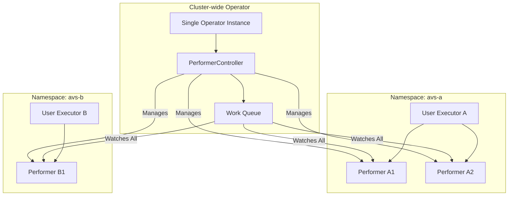
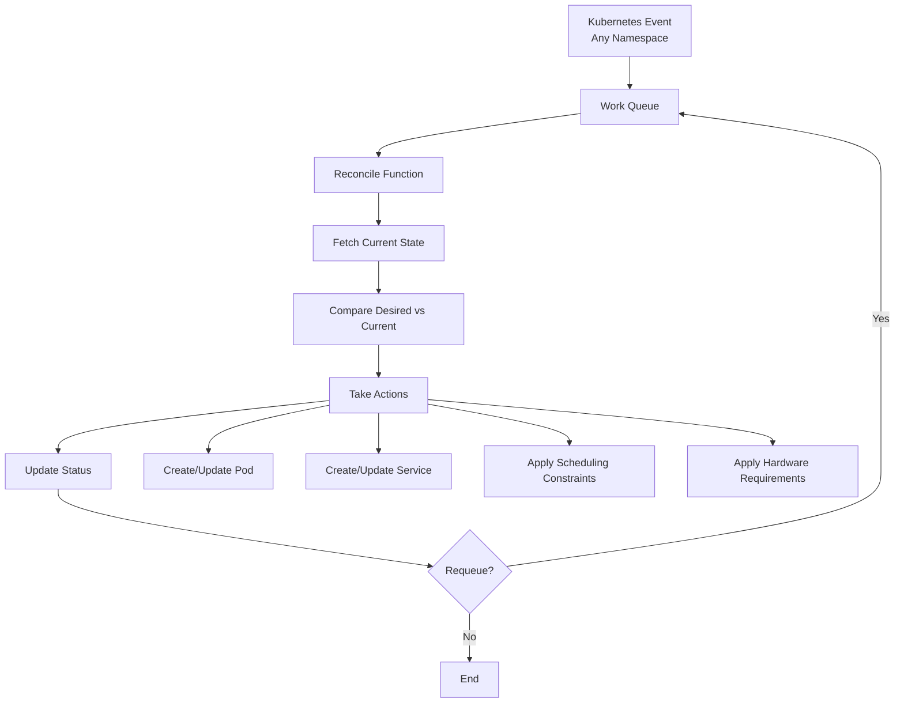
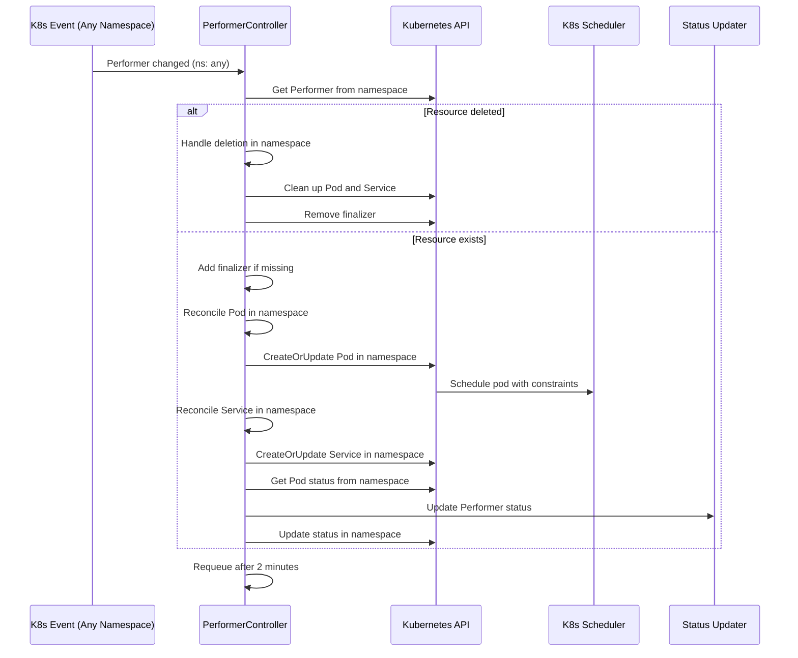
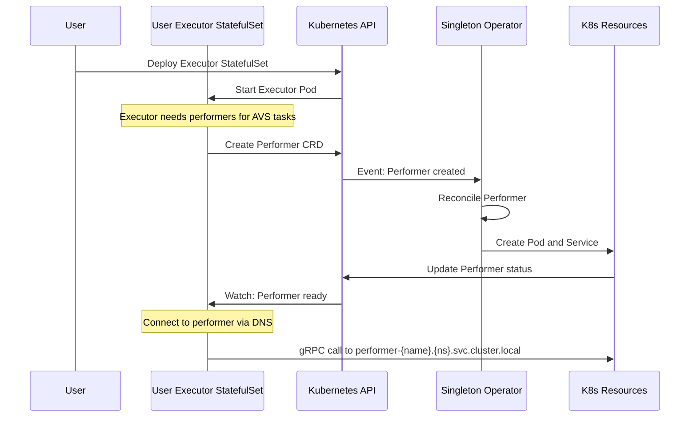

# Controller Architecture

This document describes the internal architecture of the Hourglass Kubernetes Operator controller.

**Architecture Change**: The operator now implements a **singleton pattern** with only the PerformerReconciler. The HourglassExecutorReconciler has been removed as Executors are deployed independently by users.

## Controller Overview

The operator implements a single main controller following the Kubernetes controller pattern:

1. **PerformerReconciler** - Manages performer lifecycle across all namespaces

**Removed**: HourglassExecutorReconciler - Users now deploy Executors as StatefulSets independently

## Singleton Architecture Benefits



**Key Benefits:**
- **Single operator instance** handles all Performers cluster-wide
- **Efficient resource usage** - no per-executor operator overhead
- **Centralized management** of performer lifecycle
- **User autonomy** - Executors deployed and managed independently

## Controller Pattern

The PerformerReconciler follows the standard Kubernetes reconciliation loop:



## PerformerReconciler (Singleton)

### Responsibilities

- **Cluster-wide Management**: Watch and manage Performers across all namespaces
- **Pod Lifecycle**: Create and manage individual performer pods
- **Service Management**: Create stable services for gRPC access
- **Advanced Scheduling**: Handle complex scheduling constraints (GPU, TEE, affinity)
- **Status Reporting**: Maintain detailed status for all performers
- **Resource Cleanup**: Clean up resources when performers are deleted

### Reconciliation Flow



### Key Functions

```go
// Main reconciliation entry point
func (r *PerformerReconciler) Reconcile(ctx context.Context, req ctrl.Request) (ctrl.Result, error)

// Handle resource deletion with finalizers
func (r *PerformerReconciler) handleDeletion(ctx context.Context, performer *v1alpha1.Performer) (ctrl.Result, error)

// Create/update performer pod with advanced scheduling
func (r *PerformerReconciler) reconcilePod(ctx context.Context, performer *v1alpha1.Performer) error

// Create/update stable service for gRPC access
func (r *PerformerReconciler) reconcileService(ctx context.Context, performer *v1alpha1.Performer) error

// Update resource status based on pod state
func (r *PerformerReconciler) updateStatus(ctx context.Context, performer *v1alpha1.Performer) error

// Apply GPU and TEE resource requirements
func (r *PerformerReconciler) applyHardwareRequirements(container *corev1.Container, hw *v1alpha1.HardwareRequirements)

// Generate stable DNS names for service discovery
func (r *PerformerReconciler) getServiceName(performer *v1alpha1.Performer) string
func (r *PerformerReconciler) buildGRPCEndpoint(performer *v1alpha1.Performer) string
```

### Advanced Scheduling

The controller applies sophisticated scheduling constraints using the updated affinity model:

```go
// Apply scheduling constraints
if performer.Spec.Scheduling != nil {
    pod.Spec.NodeSelector = performer.Spec.Scheduling.NodeSelector
    // Use full Kubernetes affinity specification
    pod.Spec.Affinity = performer.Spec.Scheduling.Affinity
    pod.Spec.Tolerations = performer.Spec.Scheduling.Tolerations
    if performer.Spec.Scheduling.RuntimeClass != nil {
        pod.Spec.RuntimeClassName = performer.Spec.Scheduling.RuntimeClass
    }
    if performer.Spec.Scheduling.PriorityClassName != nil {
        pod.Spec.PriorityClassName = *performer.Spec.Scheduling.PriorityClassName
    }
}
```

**Scheduling Features:**
- **Node Selection**: Basic node selector and complex affinity rules
- **Pod Anti-Affinity**: Spread performers across nodes
- **Tolerations**: Run on tainted nodes (GPU, TEE, dedicated)
- **Runtime Classes**: Support for gVisor, Kata Containers
- **Priority Classes**: High-priority performer scheduling

### Hardware Requirements

GPU and TEE requirements are translated to Kubernetes resource specifications and node constraints:

```go
// Apply GPU requirements
if hw.GPUCount > 0 {
    gpuResource := corev1.ResourceName("nvidia.com/gpu")
    if hw.GPUType != "" {
        // Support specific GPU types
        gpuResource = corev1.ResourceName(fmt.Sprintf("nvidia.com/%s", hw.GPUType))
    }
    
    gpuQuantity := resource.MustParse(fmt.Sprintf("%d", hw.GPUCount))
    container.Resources.Limits[gpuResource] = gpuQuantity
    container.Resources.Requests[gpuResource] = gpuQuantity
}

// Apply TEE requirements via node selection
if hw.TEERequired {
    if pod.Spec.NodeSelector == nil {
        pod.Spec.NodeSelector = make(map[string]string)
    }
    
    switch hw.TEEType {
    case "sgx":
        pod.Spec.NodeSelector["intel.feature.node.kubernetes.io/sgx"] = "true"
    case "sev":
        pod.Spec.NodeSelector["amd.feature.node.kubernetes.io/sev"] = "true"
    case "tdx":
        pod.Spec.NodeSelector["intel.feature.node.kubernetes.io/tdx"] = "true"
    }
}

// Apply custom hardware labels
for key, value := range hw.CustomLabels {
    if pod.Spec.NodeSelector == nil {
        pod.Spec.NodeSelector = make(map[string]string)
    }
    pod.Spec.NodeSelector[key] = value
}
```

### Service Discovery

The controller creates stable DNS names following a consistent pattern:

```go
// Generate stable service name
func (r *PerformerReconciler) getServiceName(performer *v1alpha1.Performer) string {
    return fmt.Sprintf("performer-%s", performer.Name)
}

// Build full gRPC endpoint for status
func (r *PerformerReconciler) buildGRPCEndpoint(performer *v1alpha1.Performer, service *corev1.Service) string {
    port := performer.Spec.Config.GRPCPort
    if port == 0 {
        port = 9090  // default
    }
    return fmt.Sprintf("%s.%s.svc.cluster.local:%d", 
        service.Name, 
        performer.Namespace, 
        port)
}
```

**Service Discovery Pattern:**
- **Service Name**: `performer-{performer-name}`
- **Full DNS**: `performer-{name}.{namespace}.svc.cluster.local:{port}`
- **Status Field**: `grpcEndpoint` contains full DNS name
- **Cross-Namespace**: Each namespace has its own performer services

## Error Handling

The singleton controller implements robust error handling for cluster-wide operations:

### Retry Strategy

- **Immediate requeue** for transient API errors
- **Exponential backoff** for repeated failures  
- **Periodic reconciliation** (2 minutes) for drift detection
- **Namespace-scoped errors** don't affect other namespaces

### Finalizer Management

```go
// Add finalizer for cleanup
if !controllerutil.ContainsFinalizer(performer, PerformerFinalizer) {
    controllerutil.AddFinalizer(performer, PerformerFinalizer)
    return r.Update(ctx, performer)
}

// Handle deletion
if performer.DeletionTimestamp != nil {
    // Clean up pod and service in the specific namespace
    if err := r.cleanupResources(ctx, performer); err != nil {
        return ctrl.Result{}, err
    }
    
    controllerutil.RemoveFinalizer(performer, PerformerFinalizer)
    return r.Update(ctx, performer)
}
```

### Status Management

Status updates provide observability into resource state across all namespaces:

```go
// Update status with current state
performer.Status.PodName = pod.Name
performer.Status.ServiceName = service.Name
performer.Status.GRPCEndpoint = r.buildGRPCEndpoint(performer, service)

// Determine phase based on pod state
switch pod.Status.Phase {
case corev1.PodRunning:
    if isPodReady(pod) {
        performer.Status.Phase = "Running"
        if performer.Status.ReadyTime == nil {
            now := metav1.Now()
            performer.Status.ReadyTime = &now
        }
    } else {
        performer.Status.Phase = "Pending"
    }
case corev1.PodPending:
    performer.Status.Phase = "Pending"
case corev1.PodFailed:
    performer.Status.Phase = "Failed"
default:
    performer.Status.Phase = "Unknown"
}

// Update conditions
meta.SetStatusCondition(&performer.Status.Conditions, metav1.Condition{
    Type:    "Available",
    Status:  metav1.ConditionTrue,
    Reason:  "PodReady",
    Message: "Performer pod is ready and running",
})
```

## RBAC Configuration

The singleton operator requires cluster-wide permissions to manage performers across all namespaces:

### Required Permissions

```yaml
rules:
# Core Kubernetes resources across all namespaces
- apiGroups: [""]
  resources: ["pods", "services"]
  verbs: ["create", "delete", "get", "list", "patch", "update", "watch"]

# Custom resources across all namespaces  
- apiGroups: ["hourglass.eigenlayer.io"]
  resources: ["performers", "performers/status", "performers/finalizers"]
  verbs: ["create", "delete", "get", "list", "patch", "update", "watch"]

# Read-only access for scheduling decisions
- apiGroups: [""]
  resources: ["nodes"]
  verbs: ["get", "list", "watch"]
```

**Security Considerations:**
- **Cluster-wide scope** required for singleton pattern
- **Minimal permissions** - only resources needed for performer management
- **No deployment/configmap permissions** - users manage executors independently
- **Namespace isolation** maintained through resource ownership

## Watch Configuration

The controller is configured to watch performers across all namespaces:

```go
func (r *PerformerReconciler) SetupWithManager(mgr ctrl.Manager) error {
    return ctrl.NewControllerManagedBy(mgr).
        For(&v1alpha1.Performer{}).  // Watch all Performers cluster-wide
        Owns(&corev1.Pod{}).         // Watch owned Pods
        Owns(&corev1.Service{}).     // Watch owned Services
        WithOptions(controller.Options{
            MaxConcurrentReconciles: 10,  // Handle multiple namespaces concurrently
        }).
        Complete(r)
}
```

**Watch Behavior:**
- **Cluster-wide watching** of Performer CRDs
- **Owned resource tracking** for Pods and Services
- **Concurrent reconciliation** for scalability
- **Event filtering** to reduce unnecessary work

## User-Managed Executor Integration

Since Executors are deployed by users, the controller works with them indirectly:

### Executor → Operator Flow



### Executor Requirements

For Executors to work with the singleton operator:

1. **RBAC**: Namespace-scoped permissions to manage Performers
2. **Service Discovery**: Use stable DNS names for performer connections
3. **Status Monitoring**: Watch Performer status for readiness
4. **Cleanup**: Delete Performer CRDs when shutting down

## Performance Considerations

### Resource Efficiency

- **Single operator instance** for entire cluster
- **Efficient API usage** with proper caching and batching
- **Concurrent reconciliation** across multiple namespaces
- **Minimal resource overhead** compared to per-executor operators

### Scalability

- **Horizontal scaling**: Handle hundreds of performers across namespaces
- **Rate limiting**: Prevent API server overload
- **Event filtering**: Process only relevant changes
- **Work queue optimization**: Prioritize critical operations

### Namespace Isolation

- **Resource ownership**: Each performer owned by creating executor
- **Status isolation**: Failures in one namespace don't affect others
- **RBAC boundaries**: User executors limited to their namespace
- **Network isolation**: Can be enhanced with network policies

## Testing Strategy

### Unit Tests

Test controller functions in isolation:
- **Performer creation logic** with various configurations
- **Advanced scheduling** constraint application
- **Hardware requirements** translation
- **Status updates** and condition management
- **Error handling** for API failures

### Integration Tests

Test complete reconciliation flows:
- **Multi-namespace scenarios** with multiple performers
- **Cross-namespace isolation** verification
- **Service discovery** end-to-end testing
- **Failure scenarios** and recovery testing
- **RBAC permission** validation

### Envtest Integration

Use controller-runtime's envtest for realistic testing:

```go
// Test singleton operator with multiple namespaces
func TestMultiNamespaceReconciliation(t *testing.T) {
    // Create performers in different namespaces
    performerA := createPerformer("performer-a", "namespace-a")
    performerB := createPerformer("performer-b", "namespace-b")
    
    // Verify operator handles both
    Eventually(func() bool {
        return isPerformerReady(performerA) && isPerformerReady(performerB)
    }).Should(BeTrue())
    
    // Verify namespace isolation
    Expect(performerA.Status.GRPCEndpoint).To(ContainSubstring("namespace-a"))
    Expect(performerB.Status.GRPCEndpoint).To(ContainSubstring("namespace-b"))
}
```

## Monitoring and Observability

### Metrics

The controller exposes metrics for monitoring:

- **Reconciliation rate** per namespace
- **Error rate** and types
- **Performer count** by phase and namespace
- **Resource utilization** of managed performers

### Logging

Structured logging provides operational insights:

```go
log := r.Log.WithValues("performer", req.NamespacedName, "namespace", req.Namespace)
log.Info("Reconciling performer", "phase", performer.Status.Phase)

// Namespace-specific context
log.V(1).Info("Creating pod", "podName", podName, "image", performer.Spec.Image)
log.V(1).Info("Creating service", "serviceName", serviceName, "port", grpcPort)
```

**Log Categories:**
- **Reconciliation events** with namespace context
- **Error conditions** with recovery actions
- **Performance metrics** for optimization
- **Cross-namespace operations** for debugging

This singleton architecture provides a clean, scalable solution for managing AVS performers across multiple user-deployed executors while maintaining proper isolation and resource efficiency.