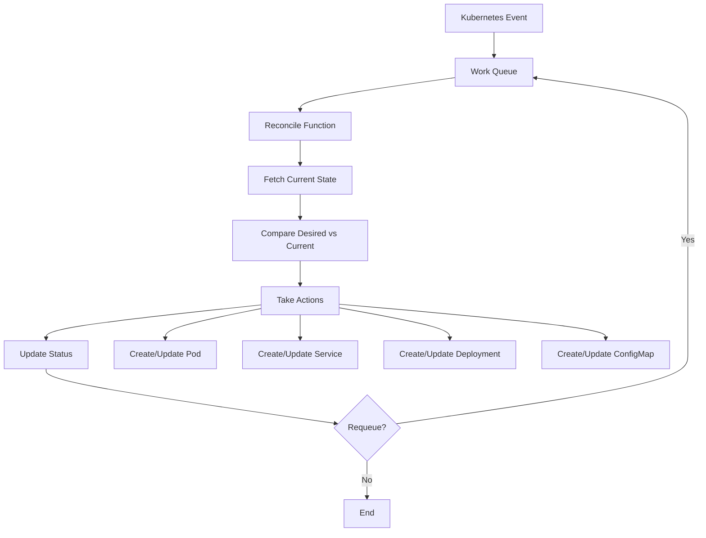
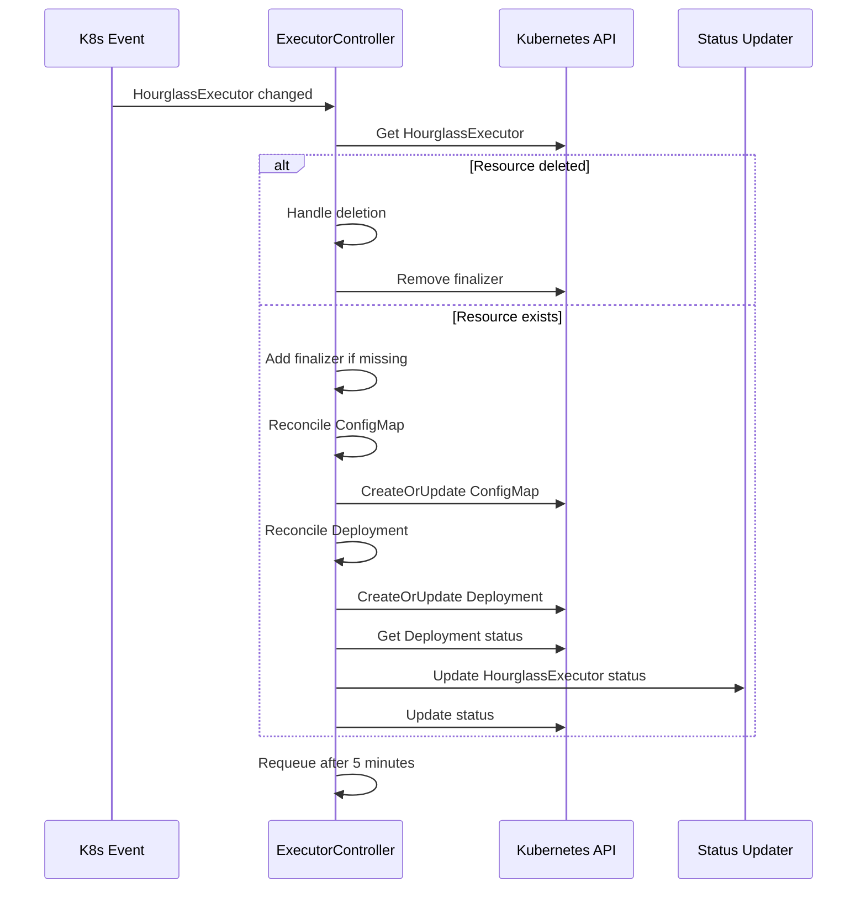
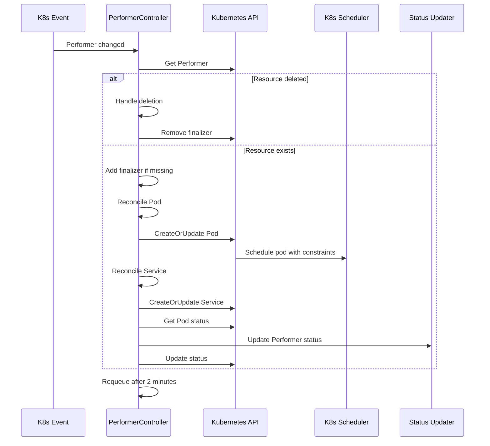

# Controller Architecture

This document describes the internal architecture of the Hourglass Kubernetes Operator controllers.

## Controller Overview

The operator implements two main controllers following the Kubernetes controller pattern:

1. **HourglassExecutorReconciler** - Manages executor lifecycle
2. **PerformerReconciler** - Manages performer lifecycle

## Controller Pattern

Both controllers follow the standard Kubernetes reconciliation loop:



## HourglassExecutorReconciler

### Responsibilities

- Deploy and manage executor pods via Kubernetes Deployments
- Create and maintain configuration via ConfigMaps
- Handle scaling and rolling updates
- Monitor health and update status

### Reconciliation Flow



### Key Functions

```go
// Main reconciliation entry point
func (r *HourglassExecutorReconciler) Reconcile(ctx context.Context, req ctrl.Request) (ctrl.Result, error)

// Handle resource deletion with finalizers
func (r *HourglassExecutorReconciler) handleDeletion(ctx context.Context, executor *v1alpha1.HourglassExecutor) (ctrl.Result, error)

// Create/update executor configuration
func (r *HourglassExecutorReconciler) reconcileConfigMap(ctx context.Context, executor *v1alpha1.HourglassExecutor) error

// Create/update executor deployment
func (r *HourglassExecutorReconciler) reconcileDeployment(ctx context.Context, executor *v1alpha1.HourglassExecutor) error

// Update resource status based on deployment state
func (r *HourglassExecutorReconciler) updateStatus(ctx context.Context, executor *v1alpha1.HourglassExecutor) error

// Generate YAML configuration for executor
func (r *HourglassExecutorReconciler) buildExecutorConfig(executor *v1alpha1.HourglassExecutor) string
```

### Configuration Management

The controller generates a YAML configuration file containing:

```yaml
aggregator_endpoint: "aggregator.hourglass.io:9090"
performer_mode: "kubernetes"
log_level: "info"
chains:
  - name: "ethereum"
    rpc: "https://eth-mainnet.alchemyapi.io/v2/..."
    chain_id: 1
    task_mailbox_address: "0x..."
kubernetes:
  namespace: "default"
```

## PerformerReconciler

### Responsibilities

- Create and manage individual performer pods
- Create stable services for gRPC access
- Handle advanced scheduling constraints
- Apply hardware requirements
- Manage upgrades and lifecycle

### Reconciliation Flow



### Key Functions

```go
// Main reconciliation entry point
func (r *PerformerReconciler) Reconcile(ctx context.Context, req ctrl.Request) (ctrl.Result, error)

// Handle resource deletion with finalizers
func (r *PerformerReconciler) handleDeletion(ctx context.Context, performer *v1alpha1.Performer) (ctrl.Result, error)

// Create/update performer pod with advanced scheduling
func (r *PerformerReconciler) reconcilePod(ctx context.Context, performer *v1alpha1.Performer) error

// Create/update stable service for gRPC access
func (r *PerformerReconciler) reconcileService(ctx context.Context, performer *v1alpha1.Performer) error

// Update resource status based on pod state
func (r *PerformerReconciler) updateStatus(ctx context.Context, performer *v1alpha1.Performer) error

// Apply GPU and TEE resource requirements
func (r *PerformerReconciler) applyHardwareRequirements(container *corev1.Container, hw *v1alpha1.HardwareRequirements)

// Generate pod and service names
func (r *PerformerReconciler) getPodName(performer *v1alpha1.Performer) string
func (r *PerformerReconciler) getServiceName(performer *v1alpha1.Performer) string
```

### Advanced Scheduling

The controller applies sophisticated scheduling constraints:

```go
// Apply scheduling constraints
if performer.Spec.Scheduling != nil {
    pod.Spec.NodeSelector = performer.Spec.Scheduling.NodeSelector
    pod.Spec.Affinity = &corev1.Affinity{
        NodeAffinity: performer.Spec.Scheduling.NodeAffinity,
    }
    pod.Spec.Tolerations = performer.Spec.Scheduling.Tolerations
    if performer.Spec.Scheduling.RuntimeClass != nil {
        pod.Spec.RuntimeClassName = performer.Spec.Scheduling.RuntimeClass
    }
}
```

### Hardware Requirements

GPU and TEE requirements are translated to Kubernetes resource specifications:

```go
// Apply GPU requirements
if hw.GPUCount > 0 {
    gpuResource := corev1.ResourceName("nvidia.com/gpu")
    if hw.GPUType != "" {
        gpuResource = corev1.ResourceName(fmt.Sprintf("nvidia.com/%s", hw.GPUType))
    }
    
    gpuQuantity := resource.MustParse(fmt.Sprintf("%d", hw.GPUCount))
    container.Resources.Limits[gpuResource] = gpuQuantity
    container.Resources.Requests[gpuResource] = gpuQuantity
}
```

## Error Handling

Both controllers implement robust error handling:

### Retry Strategy

- **Immediate requeue** for transient API errors
- **Exponential backoff** for repeated failures
- **Periodic reconciliation** (2-5 minutes) for drift detection

### Finalizer Management

```go
// Add finalizer for cleanup
if !controllerutil.ContainsFinalizer(&resource, finalizerName) {
    controllerutil.AddFinalizer(&resource, finalizerName)
    return r.Update(ctx, &resource)
}

// Handle deletion
if resource.DeletionTimestamp != nil {
    // Perform cleanup
    controllerutil.RemoveFinalizer(&resource, finalizerName)
    return r.Update(ctx, &resource)
}
```

### Status Management

Status updates provide observability into resource state:

```go
// Update status with current state
executor.Status.Replicas = deployment.Status.Replicas
executor.Status.ReadyReplicas = deployment.Status.ReadyReplicas
executor.Status.LastConfigUpdate = &metav1.Time{Time: time.Now()}

if deployment.Status.ReadyReplicas == deployment.Status.Replicas {
    executor.Status.Phase = "Running"
} else {
    executor.Status.Phase = "Pending"
}
```

## Owner References

The controllers establish proper ownership hierarchies:

- **HourglassExecutor** owns its Deployment and ConfigMap
- **Performer** owns its Pod and Service

This ensures automatic cleanup when parent resources are deleted.

## Watch Configuration

Controllers are configured to watch relevant resources:

```go
func (r *HourglassExecutorReconciler) SetupWithManager(mgr ctrl.Manager) error {
    return ctrl.NewControllerManagedBy(mgr).
        For(&v1alpha1.HourglassExecutor{}).
        Owns(&appsv1.Deployment{}).
        Owns(&corev1.ConfigMap{}).
        Complete(r)
}

func (r *PerformerReconciler) SetupWithManager(mgr ctrl.Manager) error {
    return ctrl.NewControllerManagedBy(mgr).
        For(&v1alpha1.Performer{}).
        Owns(&corev1.Pod{}).
        Owns(&corev1.Service{}).
        Complete(r)
}
```

## Performance Considerations

### Resource Efficiency

- **Single pod per Performer** for resource isolation
- **Deployment pattern for Executors** for high availability
- **Efficient status updates** to minimize API calls

### Scalability

- **Concurrent reconciliation** via worker pools
- **Rate limiting** to prevent API server overload
- **Event filtering** to reduce unnecessary reconciliations

## Testing Strategy

### Unit Tests

Test individual controller functions:
- Configuration generation
- Resource creation logic
- Status update logic
- Error handling paths

### Integration Tests

Test complete reconciliation flows:
- End-to-end resource lifecycle
- Cross-resource dependencies
- Failure scenarios and recovery

### Envtest Integration

Use controller-runtime's envtest for realistic testing:
- Real Kubernetes API server
- Full CRD validation
- RBAC permission testing