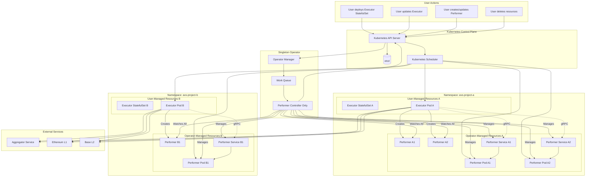
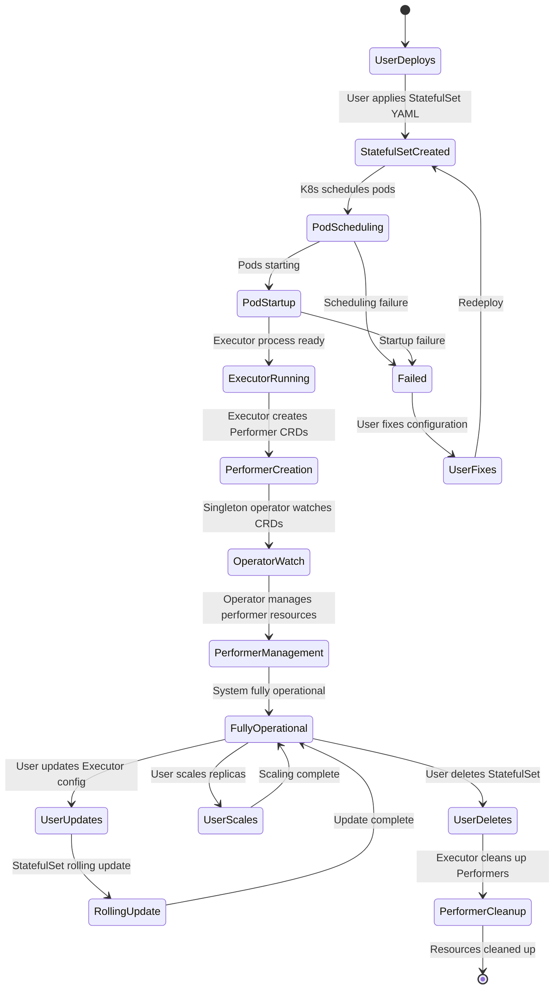
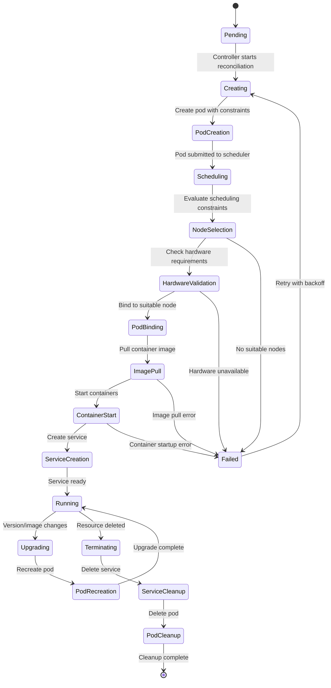
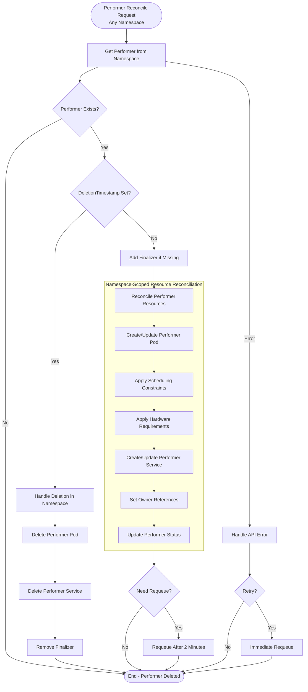
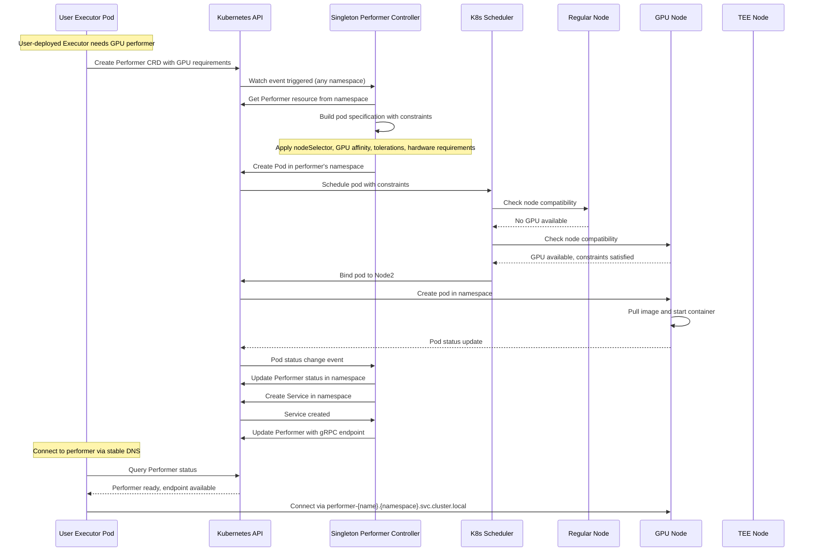
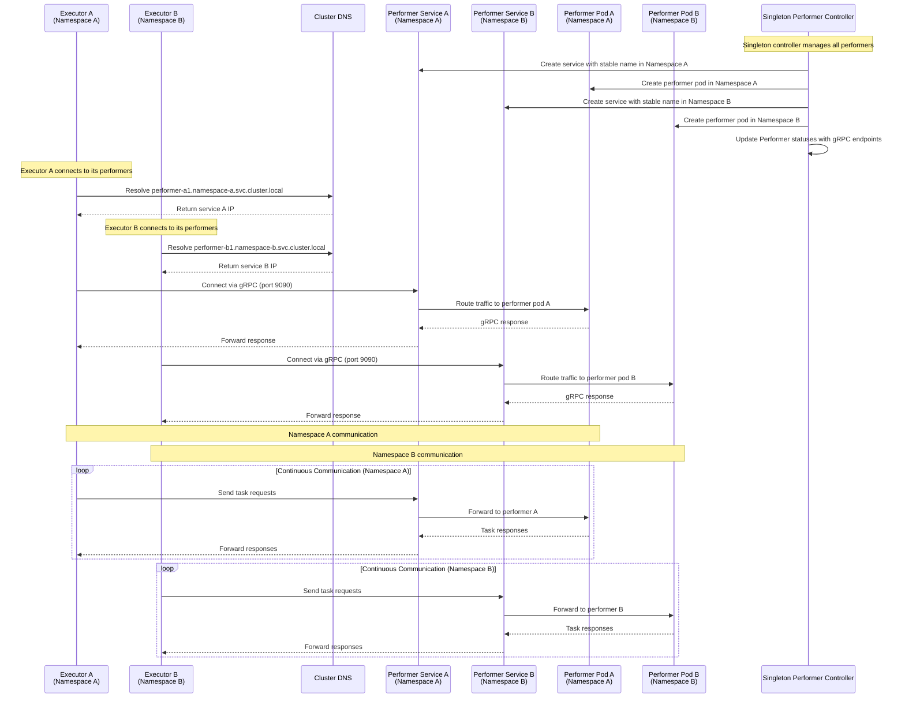
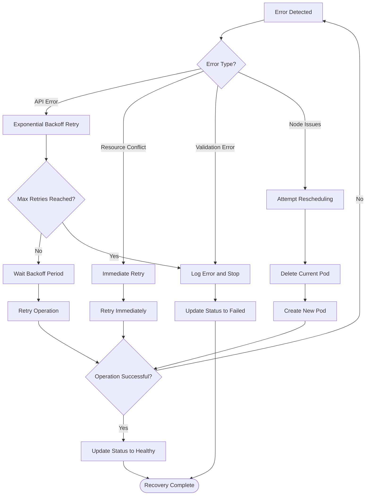
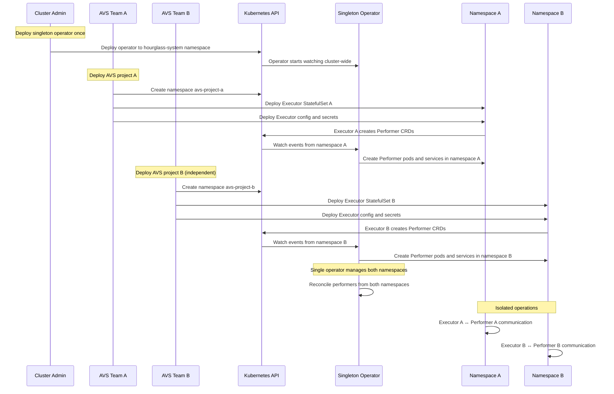
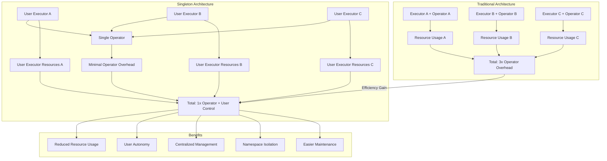

# Process Flow Diagrams

This document contains detailed process flow diagrams showing how the **singleton** Hourglass Kubernetes Operator manages resource lifecycles across multiple user-deployed Executors.

## Overall System Flow (Singleton Architecture)

## User-Managed Executor Lifecycle

## Performer Lifecycle

## Singleton Performer Controller Reconciliation Loop

## Advanced Scheduling Flow (Singleton Operator)

## Hardware Requirements Processing

## Service Discovery Flow (Multi-Namespace)

## Error Handling and Recovery

## Multi-Namespace Deployment Flow

## Singleton Operator Benefits Flow

These diagrams provide a comprehensive view of how the **singleton** Hourglass Kubernetes Operator orchestrates complex workflows across multiple user-managed executors, specialized hardware scheduling, and multi-namespace service discovery patterns while maintaining operational efficiency and user autonomy.