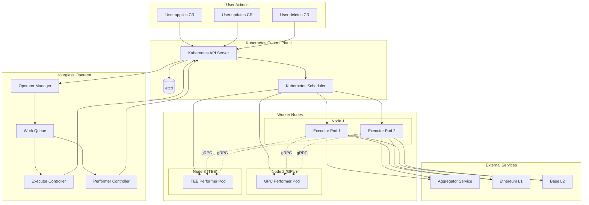
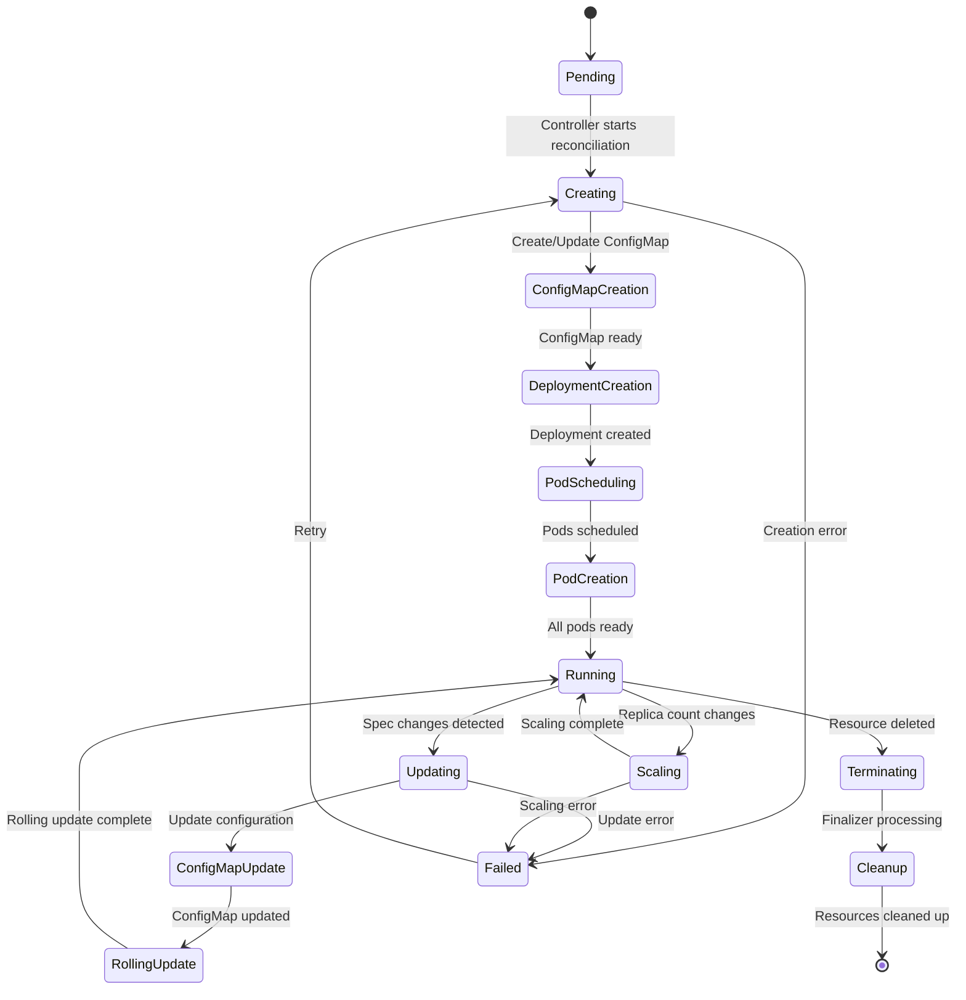
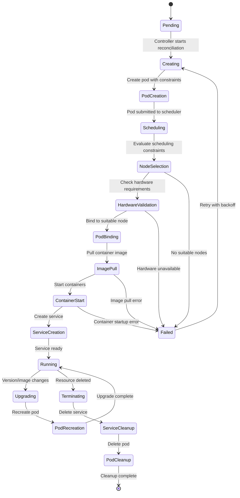
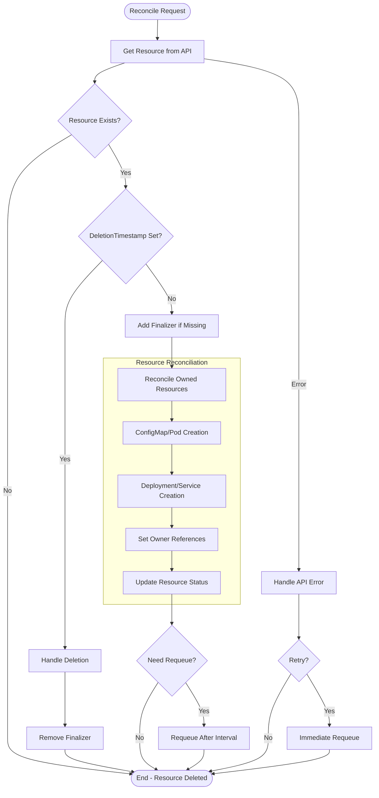
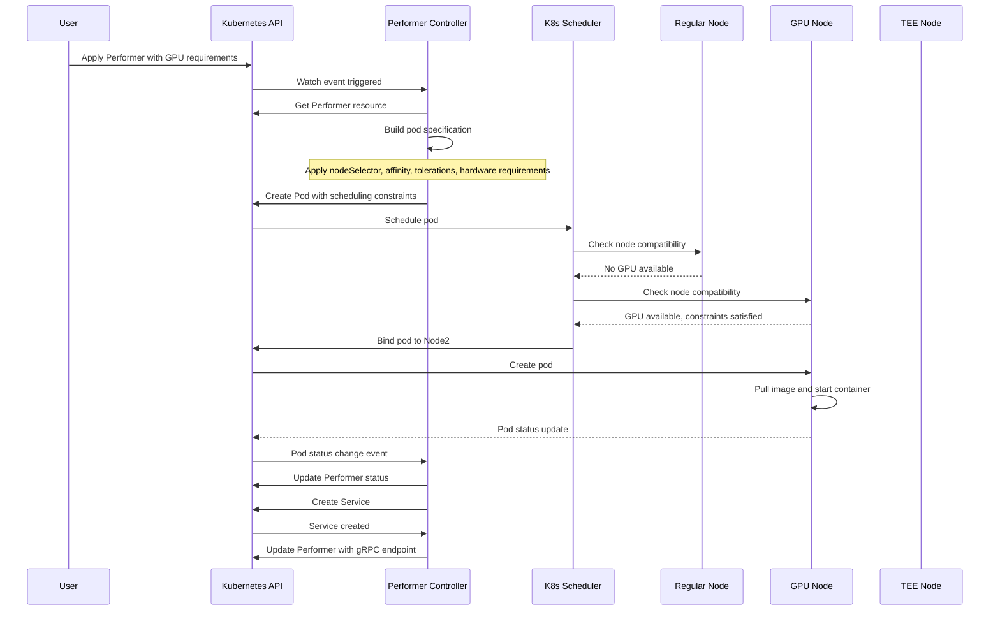
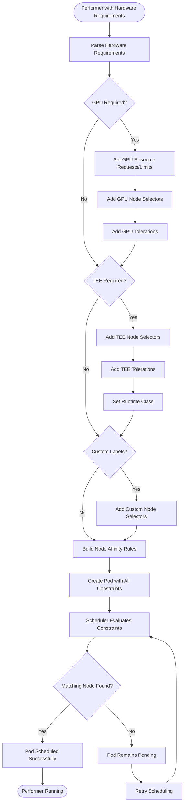
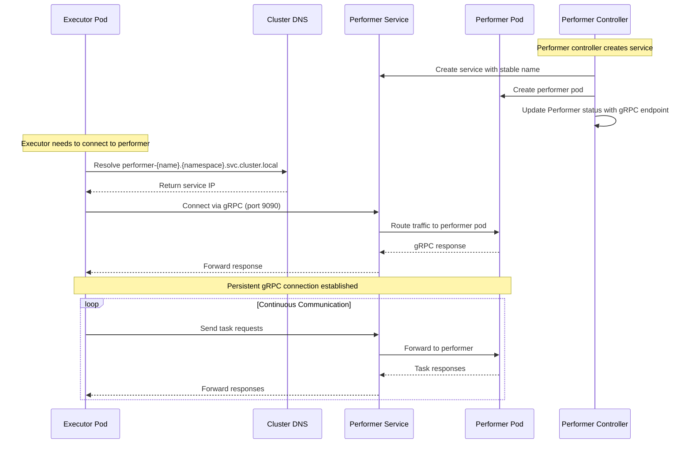
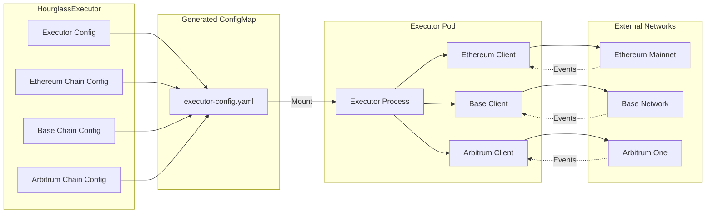

# Process Flow Diagrams

This document contains detailed process flow diagrams showing how the Hourglass Kubernetes Operator manages resource lifecycles.

## Overall System Flow

## HourglassExecutor Lifecycle

## Performer Lifecycle

## Controller Reconciliation Loop

## Advanced Scheduling Flow

## Hardware Requirements Processing

## Service Discovery Flow

## Error Handling and Recovery

## Multi-Chain Executor Configuration

These diagrams provide a comprehensive view of how the Hourglass Kubernetes Operator orchestrates complex workflows involving multiple chains, specialized hardware, and service discovery patterns.