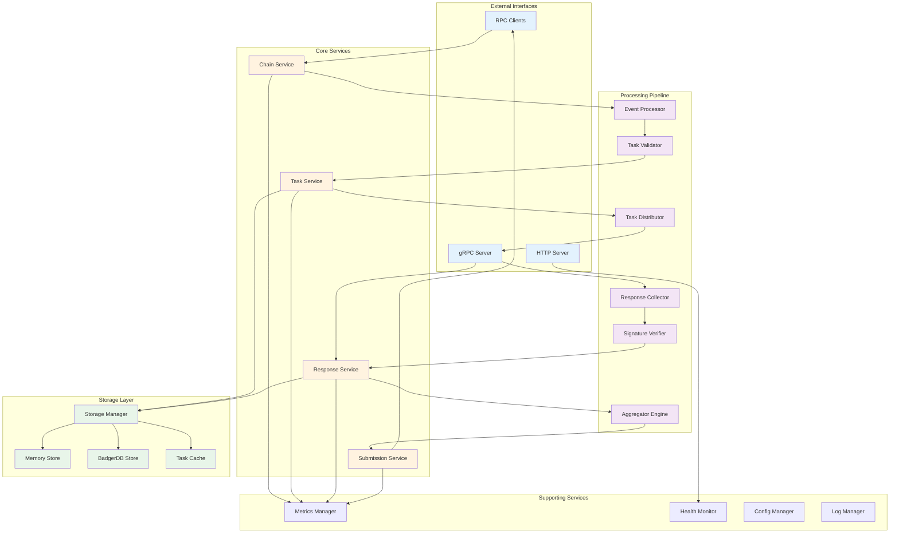
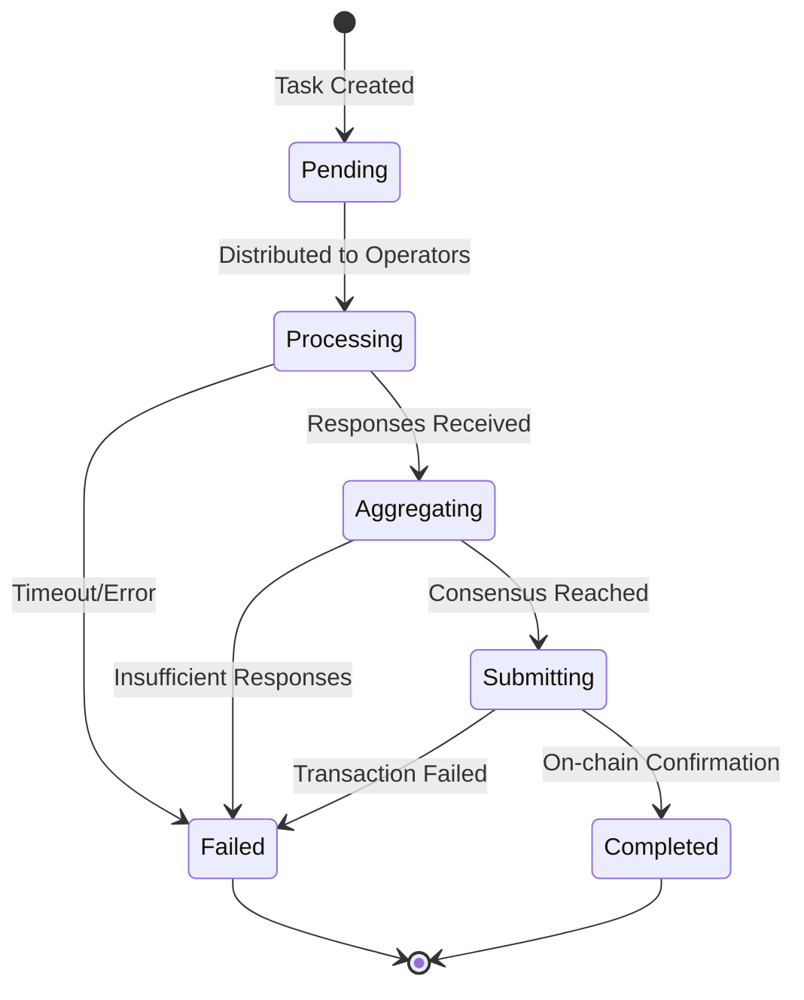
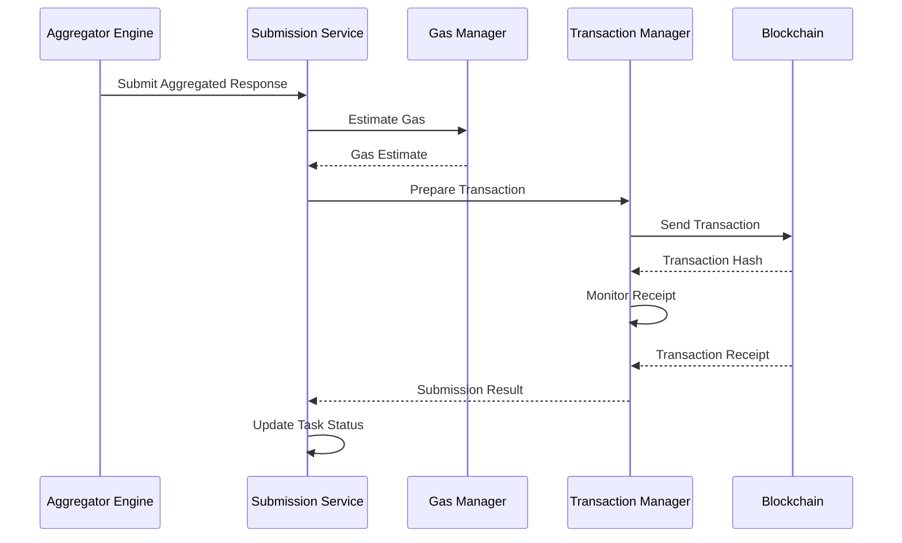

# Aggregator Component Deep Dive

The Ponos Aggregator is the central coordination service responsible for orchestrating task execution across a distributed network of operators. This document provides an in-depth look at its internal architecture and implementation details.

## Internal Architecture



## Core Services

### 1. Chain Service

The Chain Service manages blockchain interactions and synchronization.

**Responsibilities:**
- Maintain RPC client connections for each configured chain
- Handle block polling and event filtering
- Manage reorg detection and handling
- Track synchronization progress

**Key Components:**

```go
type ChainService struct {
    clients    map[ChainId]*ethclient.Client
    pollers    map[ChainId]*BlockPoller
    eventStore *EventStore
    mu         sync.RWMutex
}

type BlockPoller struct {
    chainId           ChainId
    client            *ethclient.Client
    lastProcessed     uint64
    confirmations     uint64
    pollInterval      time.Duration
    maxBlockRange     uint64
}
```

**Event Processing Flow:**
1. Poll blocks at configured intervals
2. Filter for TaskCreated events
3. Wait for required confirmations
4. Emit events to Task Service
5. Update last processed block

### 2. Task Service

The Task Service manages the complete lifecycle of tasks.

**Responsibilities:**
- Validate incoming tasks
- Manage task state transitions
- Distribute tasks to operators
- Track task completion

**State Machine:**



**Key Data Structures:**

```go
type TaskManager struct {
    tasks          map[string]*TaskState
    operatorSets   map[string]*OperatorSet
    distribution   *DistributionEngine
    storage        AggregatorStore
}

type TaskState struct {
    Task            *types.Task
    Status          TaskStatus
    Responses       map[string]*SignedResponse
    DistributedAt   time.Time
    CompletedAt     *time.Time
    Error           error
}
```

### 3. Response Service

The Response Service collects and validates operator responses.

**Responsibilities:**
- Accept responses via gRPC
- Validate response signatures
- Check operator eligibility
- Enforce response deadlines
- Trigger aggregation when ready

**Validation Pipeline:**

```go
func (rs *ResponseService) ValidateResponse(resp *Response) error {
    // 1. Check task exists and is accepting responses
    if !rs.isTaskAcceptingResponses(resp.TaskId) {
        return ErrTaskNotAcceptingResponses
    }
    
    // 2. Verify operator is in correct set
    if !rs.isOperatorEligible(resp.OperatorAddress, resp.TaskId) {
        return ErrOperatorNotEligible
    }
    
    // 3. Validate signature
    if !rs.verifySignature(resp) {
        return ErrInvalidSignature
    }
    
    // 4. Check for duplicate responses
    if rs.hasPreviousResponse(resp.TaskId, resp.OperatorAddress) {
        return ErrDuplicateResponse
    }
    
    // 5. Validate response format
    if err := rs.validateResponseFormat(resp); err != nil {
        return err
    }
    
    return nil
}
```

### 4. Submission Service

The Submission Service handles aggregated response submission to the blockchain.

**Responsibilities:**
- Prepare aggregated responses
- Manage transaction submission
- Handle gas estimation
- Implement retry logic
- Track submission status

**Submission Flow:**



## Processing Pipeline

### Event Processor

Processes blockchain events and converts them to internal task representations.

**Key Features:**
- Event deduplication
- Multi-chain event ordering
- Reorg handling
- Event persistence

### Task Validator

Validates tasks before processing.

**Validation Steps:**
1. **Format Validation**: Check task structure and required fields
2. **AVS Validation**: Verify AVS contract exists and is active
3. **Operator Set Validation**: Ensure operator set is registered
4. **Deadline Validation**: Check task hasn't expired
5. **Payload Validation**: Verify payload size and format

### Task Distributor

Distributes tasks to eligible operators.

**Distribution Strategy:**
```go
type DistributionStrategy interface {
    SelectOperators(task *Task, operatorSet *OperatorSet) []Operator
    GetDistributionMethod() DistributionMethod
}

type BroadcastStrategy struct{}     // Send to all operators
type QuorumStrategy struct{}        // Send to minimum quorum
type LoadBalancedStrategy struct{}  // Distribute based on load
```

### Response Collector

Collects responses from operators with timeout management.

**Collection Logic:**
- Start collection timer on task distribution
- Track responses by operator
- Check consensus thresholds
- Trigger aggregation or timeout

### Signature Verifier

Verifies cryptographic signatures on responses.

**Supported Schemes:**
- ECDSA with secp256k1
- BLS on BN254 curve
- BLS on BLS12-381 curve

**Verification Process:**
```go
func (sv *SignatureVerifier) Verify(
    message []byte, 
    signature []byte, 
    publicKey []byte,
    scheme SignatureScheme,
) error {
    switch scheme {
    case ECDSA:
        return sv.verifyECDSA(message, signature, publicKey)
    case BLS_BN254:
        return sv.verifyBLSBN254(message, signature, publicKey)
    case BLS_BLS12381:
        return sv.verifyBLSBLS12381(message, signature, publicKey)
    default:
        return ErrUnsupportedScheme
    }
}
```

### Aggregator Engine

Aggregates operator responses based on consensus rules.

**Aggregation Process:**
1. **Stake Calculation**: Calculate total stake of responding operators
2. **Threshold Check**: Verify stake meets consensus threshold
3. **Response Grouping**: Group identical responses
4. **Signature Aggregation**: Aggregate signatures for efficiency
5. **Result Preparation**: Prepare final aggregated result

## Storage Layer

### Storage Backends

**Memory Store:**
- Fast, ephemeral storage
- Suitable for development/testing
- No persistence across restarts

**BadgerDB Store:**
- Embedded key-value store
- Persistent storage
- ACID transactions
- Configurable performance

### Task Cache

High-performance cache for active tasks.

**Cache Strategy:**
- LRU eviction for completed tasks
- TTL-based expiration
- Write-through to persistent storage
- Preload recent tasks on startup

## Supporting Services

### Metrics Manager

Collects and exposes operational metrics.

**Key Metrics:**
- Task processing latency
- Response collection rate
- Consensus achievement rate
- Chain synchronization lag
- Storage operations performance
- gRPC connection metrics

### Health Monitor

Monitors system health and provides status endpoints.

**Health Checks:**
- RPC connectivity
- Storage availability
- Memory usage
- Goroutine count
- Task processing pipeline

### Config Manager

Manages configuration and hot-reloading.

**Configuration Layers:**
1. Default configuration
2. File-based configuration
3. Environment variables
4. Runtime updates

### Log Manager

Structured logging with context propagation.

**Log Structure:**
```json
{
  "timestamp": "2024-01-15T10:30:45Z",
  "level": "info",
  "component": "task_service",
  "task_id": "0x123...",
  "chain_id": 1,
  "message": "Task distributed to operators",
  "operator_count": 5,
  "duration_ms": 125
}
```

## Performance Optimizations

### Concurrent Processing
- Parallel chain polling
- Concurrent response validation
- Batched storage operations
- Pipeline processing stages

### Memory Management
- Task pool recycling
- Response buffer pools
- Bounded queues
- Garbage collection tuning

### Network Optimization
- Connection pooling
- Request batching
- Compression for large payloads
- Efficient serialization

## Security Considerations

### Key Management
- Secure key storage
- Key rotation support
- Hardware security module integration
- Multi-signature support

### Access Control
- gRPC authentication
- TLS for transport security
- Rate limiting
- IP whitelisting

### Validation
- Input sanitization
- Signature verification
- Replay attack prevention
- Consensus manipulation protection

## Monitoring and Operations

### Operational Metrics

**Dashboard Components:**
- Task processing funnel
- Operator response rates
- Chain synchronization status
- Error rates and types
- Resource utilization

### Alerting Rules

**Critical Alerts:**
- Chain RPC failures
- Storage errors
- Consensus failures
- High error rates
- Resource exhaustion

### Debugging Tools

**Built-in Tools:**
- Task state inspector
- Response analyzer
- Chain sync debugger
- Performance profiler
- Trace logging

## Scaling Considerations

### Horizontal Scaling
- Active-passive failover
- Read replica support
- Task sharding
- Chain-specific instances

### Vertical Scaling
- Resource allocation guidelines
- Performance benchmarks
- Bottleneck identification
- Optimization strategies

### Storage Scaling
- Data retention policies
- Archival strategies
- Compaction schedules
- Migration procedures