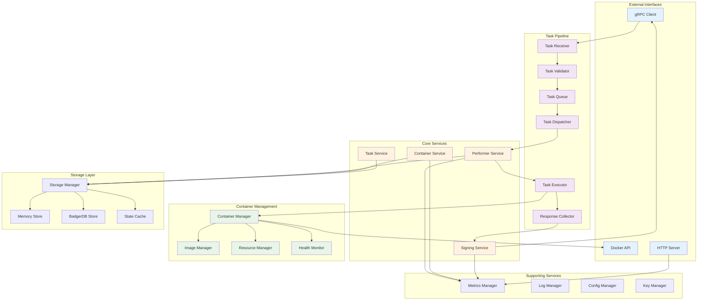
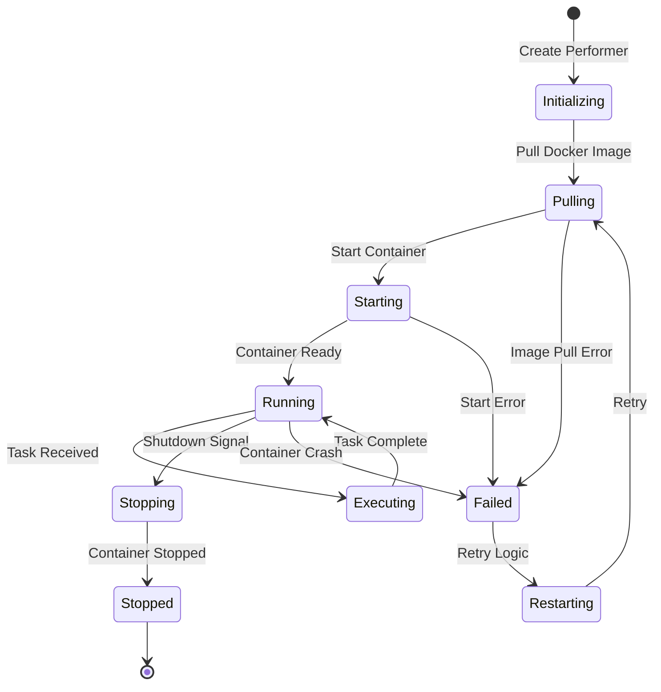
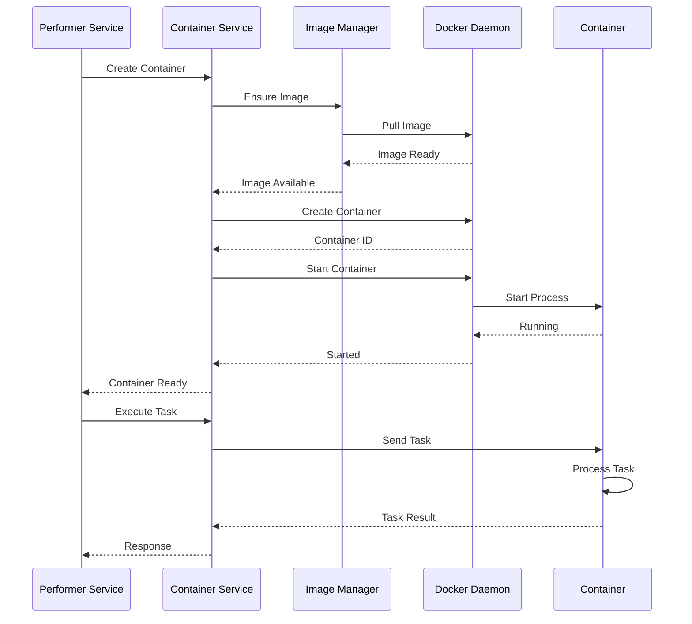
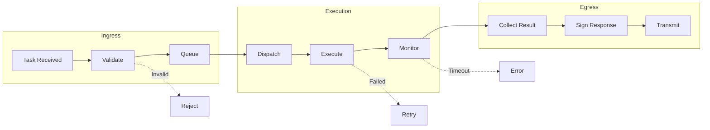

# Executor Component Deep Dive

The Ponos Executor is responsible for running AVS workloads on operator infrastructure. It manages containerized execution environments, handles task routing, and ensures secure response generation. This document provides an in-depth analysis of its internal architecture.

## Internal Architecture



## Core Services

### 1. Performer Service

The Performer Service manages AVS-specific execution environments (performers).

**Responsibilities:**
- Performer lifecycle management
- Task routing to appropriate performers
- Response collection from containers
- State synchronization

**Performer Lifecycle:**



**Key Components:**

```go
type PerformerService struct {
    performers    map[string]*Performer
    taskRouter    *TaskRouter
    containerSvc  *ContainerService
    storage       ExecutorStore
    mu           sync.RWMutex
}

type Performer struct {
    ID            string
    AVSAddress    string
    ContainerID   string
    Image         DockerImage
    Status        PerformerStatus
    TaskChannel   chan *Task
    ResponseChan  chan *Response
    Metrics       *PerformerMetrics
}

type TaskRouter struct {
    routes       map[string]string  // AVSAddress -> PerformerID
    loadBalancer LoadBalancer
}
```

### 2. Container Service

The Container Service interfaces with Docker to manage container lifecycle.

**Responsibilities:**
- Docker API interactions
- Container lifecycle management
- Resource allocation and limits
- Log collection and forwarding

**Container Management Flow:**

```go
type ContainerService struct {
    client        *docker.Client
    containers    map[string]*ContainerInfo
    imageCache    *ImageCache
    resourceMgr   *ResourceManager
}

type ContainerInfo struct {
    ID            string
    Name          string
    Image         string
    Status        ContainerStatus
    Resources     ResourceLimits
    RestartPolicy RestartPolicy
    CreatedAt     time.Time
    StartedAt     *time.Time
}

type ResourceLimits struct {
    CPUQuota     int64    // microseconds per period
    CPUPeriod    int64    // period length in microseconds
    MemoryLimit  int64    // bytes
    MemorySwap   int64    // bytes
    GPUDevices   []string // GPU device IDs
}
```

**Container Operations:**



### 3. Signing Service

The Signing Service manages cryptographic operations for response signing.

**Responsibilities:**
- Key material management
- Response signing
- Signature scheme selection
- Hardware security module integration

**Signing Architecture:**

```go
type SigningService struct {
    signers      map[SignatureType]Signer
    keyManager   *KeyManager
    hsmClient    *HSMClient
}

type Signer interface {
    Sign(message []byte, key PrivateKey) ([]byte, error)
    Verify(message, signature []byte, pubKey PublicKey) error
    GetScheme() SignatureScheme
}

type ECDSASigner struct {
    curve elliptic.Curve
}

type BLSSigner struct {
    curve CurveType  // BN254 or BLS12-381
}
```

**Signing Flow:**

1. **Message Preparation**: Serialize response data
2. **Hash Generation**: Create cryptographic hash
3. **Key Selection**: Choose appropriate signing key
4. **Signature Generation**: Sign using selected scheme
5. **Signature Verification**: Self-verify before sending

### 4. Task Service

The Task Service manages task execution lifecycle within the executor.

**Responsibilities:**
- Task queue management
- Execution orchestration
- Timeout enforcement
- Error handling and retries

**Task Execution Pipeline:**



## Task Pipeline

### Task Receiver

Receives tasks from the aggregator via gRPC.

**Features:**
- gRPC streaming for efficiency
- Automatic reconnection
- Backpressure handling
- Duplicate detection

### Task Validator

Validates tasks before execution.

**Validation Steps:**
1. **Signature Verification**: Verify aggregator signature
2. **AVS Check**: Ensure AVS is supported
3. **Deadline Check**: Verify task hasn't expired
4. **Resource Check**: Ensure sufficient resources
5. **Performer Check**: Verify performer is ready

### Task Queue

Manages pending tasks with priority and fairness.

**Queue Implementation:**
```go
type TaskQueue struct {
    queues      map[string]*PriorityQueue  // Per-AVS queues
    maxSize     int
    overflow    OverflowPolicy
    metrics     *QueueMetrics
}

type PriorityQueue struct {
    heap        TaskHeap
    mu          sync.Mutex
}

type Task struct {
    ID          string
    Priority    int
    Deadline    time.Time
    AVSAddress  string
    Payload     []byte
}
```

### Task Dispatcher

Routes tasks to appropriate performers.

**Dispatch Logic:**
- Match task AVS address to performer
- Check performer capacity
- Apply rate limiting
- Handle dispatch failures

### Task Executor

Manages task execution within containers.

**Execution Protocol:**
```go
type ExecutionProtocol interface {
    SendTask(task *Task) error
    ReceiveResponse() (*Response, error)
    GetTimeout() time.Duration
}

type GRPCProtocol struct {
    client  TaskServiceClient
    timeout time.Duration
}

type HTTPProtocol struct {
    client  *http.Client
    baseURL string
    timeout time.Duration
}
```

### Response Collector

Collects and validates responses from containers.

**Collection Process:**
1. Wait for response or timeout
2. Validate response format
3. Check response integrity
4. Extract result data
5. Prepare for signing

## Container Management

### Container Manager

Central orchestrator for all container operations.

**Management Strategies:**

```go
type ContainerManager struct {
    strategy     ManagementStrategy
    policy       RestartPolicy
    monitor      *HealthMonitor
    cleaner      *ResourceCleaner
}

type ManagementStrategy interface {
    ShouldRestart(container *ContainerInfo) bool
    AllocateResources(requirements ResourceRequirements) ResourceLimits
    HandleFailure(container *ContainerInfo, error error) Action
}
```

### Image Manager

Manages Docker images efficiently.

**Features:**
- Image caching
- Pull policies
- Version management
- Garbage collection

**Image Pull Strategy:**
```go
type PullPolicy string

const (
    PullAlways       PullPolicy = "Always"
    PullIfNotPresent PullPolicy = "IfNotPresent"
    PullNever        PullPolicy = "Never"
)

type ImageManager struct {
    client      *docker.Client
    cache       *ImageCache
    pullPolicy  PullPolicy
    registry    RegistryConfig
}
```

### Resource Manager

Allocates and tracks resource usage.

**Resource Tracking:**
```go
type ResourceManager struct {
    totalCPU     int64
    totalMemory  int64
    totalGPU     []GPUDevice
    allocated    map[string]ResourceLimits
    mu           sync.RWMutex
}

type ResourceAllocation struct {
    ContainerID  string
    CPU          float64  // cores
    Memory       int64    // bytes
    GPU          []int    // device indices
    Bandwidth    int64    // bytes/sec
}
```

### Health Monitor

Monitors container health and performance.

**Health Checks:**
- Container running status
- Process liveness
- Endpoint readiness
- Resource utilization
- Log analysis

**Health Check Implementation:**
```go
type HealthMonitor struct {
    checks      map[string]HealthCheck
    interval    time.Duration
    failures    map[string]int
    actions     map[HealthStatus]Action
}

type HealthCheck interface {
    Check(container *ContainerInfo) (HealthStatus, error)
    GetType() CheckType
}

type LivenessCheck struct {
    endpoint string
    timeout  time.Duration
}

type ReadinessCheck struct {
    command  []string
    expected string
}
```

## Storage Layer

### Storage Architecture

Provides persistence for executor state.

**Storage Schema:**
```go
type ExecutorStore interface {
    // Performer state
    SavePerformerState(performerId string, state *PerformerState) error
    GetPerformerState(performerId string) (*PerformerState, error)
    ListPerformers() ([]*PerformerState, error)
    
    // Task tracking
    SaveInflightTask(taskId string, task *TaskInfo) error
    GetInflightTask(taskId string) (*TaskInfo, error)
    DeleteInflightTask(taskId string) error
    ListInflightTasks() ([]*TaskInfo, error)
    
    // Deployment info
    SaveDeployment(deploymentId string, info *DeploymentInfo) error
    GetDeployment(deploymentId string) (*DeploymentInfo, error)
    
    // Metrics
    SaveMetrics(timestamp time.Time, metrics *ExecutorMetrics) error
    GetMetrics(start, end time.Time) ([]*ExecutorMetrics, error)
}
```

### State Management

Maintains consistent state across restarts.

**State Recovery Process:**
1. Load performer configurations
2. Verify container states
3. Reconcile with Docker daemon
4. Resume inflight tasks
5. Re-establish connections

## Supporting Services

### Metrics Collection

Comprehensive metrics for monitoring.

**Key Metrics:**
```go
type ExecutorMetrics struct {
    // Task metrics
    TasksReceived       Counter
    TasksExecuted       Counter
    TasksFailed         Counter
    TaskExecutionTime   Histogram
    
    // Container metrics
    ContainersRunning   Gauge
    ContainerRestarts   Counter
    ContainerCPUUsage   Gauge
    ContainerMemUsage   Gauge
    
    // Resource metrics
    CPUUtilization      Gauge
    MemoryUtilization   Gauge
    DiskIOPS            Gauge
    NetworkBandwidth    Gauge
    
    // Health metrics
    HealthCheckFailures Counter
    UptimeSeconds       Counter
}
```

### Log Management

Structured logging with correlation.

**Log Aggregation:**
- Container stdout/stderr capture
- Structured log parsing
- Log forwarding
- Retention policies

### Configuration Management

Dynamic configuration with validation.

**Configuration Hierarchy:**
1. Default values
2. Configuration file
3. Environment variables
4. Runtime updates
5. Per-AVS overrides

### Key Management

Secure key storage and access.

**Key Storage Options:**
- File-based with encryption
- Environment variables
- Hardware security modules
- Cloud key management services
- Kubernetes secrets

## Performance Optimizations

### Resource Pooling
- Container pre-warming
- Connection pooling
- Buffer recycling
- Goroutine pools

### Caching Strategies
- Image layer caching
- Task result caching
- Configuration caching
- DNS caching

### Concurrency Control
- Worker pool sizing
- Rate limiting
- Backpressure handling
- Circuit breakers

## Security Considerations

### Container Security
- User namespace remapping
- Seccomp profiles
- AppArmor/SELinux policies
- Read-only root filesystems
- Network isolation

### Key Security
- Encryption at rest
- Key rotation
- Access control
- Audit logging
- HSM integration

### Network Security
- TLS for all connections
- Certificate validation
- Network policies
- Firewall rules

## Operational Considerations

### Deployment Patterns

**Single-Host Deployment:**
- All containers on one host
- Shared resources
- Simple management

**Multi-Host Deployment:**
- Distributed containers
- Load balancing
- High availability

### Monitoring Integration

**Prometheus Metrics:**
- Custom metric exporters
- Service discovery
- Alert rules
- Grafana dashboards

### Debugging Tools

**Built-in Debugging:**
- Task trace logs
- Container inspection
- Performance profiling
- State dump utilities

### Maintenance Operations

**Routine Maintenance:**
- Log rotation
- Image cleanup
- State compaction
- Certificate renewal
- Security updates