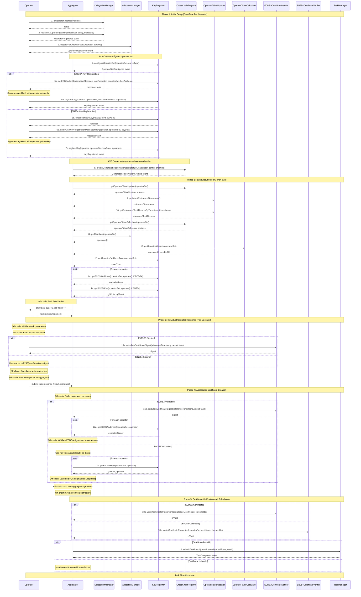

# EigenLayer Contract Call Sequencing: Complete Step-by-Step Guide

This document provides the **exact sequential steps** for implementing multi-signature systems on EigenLayer, with concrete payload examples and complete contract call flows.

## Prerequisites and Setup

### Contract Addresses (Ethereum Anvil - Sepolia Fork)
```solidity
// Core EigenLayer contracts (Chain ID: 31337)
address constant DELEGATION_MANAGER = 0xd4a7e1bd8015057293f0d0a557088c286942e84b;
address constant ALLOCATION_MANAGER = 0x42583067658071247ec8ce0a516a58f682002d07;
address constant KEY_REGISTRAR = 0xA4dB30D08d8bbcA00D40600bee9F029984dB162a;
address constant CROSS_CHAIN_REGISTRY = 0x287381B1570d9048c4B4C7EC94d21dDb8Aa1352a;
address constant ECDSA_CERTIFICATE_VERIFIER = 0xb3Cd1A457dEa9A9A6F6406c6419B1c326670A96F;
address constant BN254_CERTIFICATE_VERIFIER = 0xff58A373c18268F483C1F5cA03Cf885c0C43373a;
address constant TASK_MAILBOX = 0xB99CC53e8db7018f557606C2a5B066527bF96b26;

// Note: OPERATOR_TABLE_UPDATER and OPERATOR_TABLE_CALCULATOR addresses would be
// obtained from the CrossChainRegistry contract dynamically

// Your configuration
address constant YOUR_AVS_ADDRESS = 0x1234567890123456789012345678901234567890;
uint32 constant YOUR_OPERATOR_SET_ID = 1;
address constant YOUR_OPERATOR_ADDRESS = 0xabcdefabcdefabcdefabcdefabcdefabcdefabcd;
address constant YOUR_EARNINGS_RECEIVER = 0xabcdefabcdefabcdefabcdefabcdefabcdefabcd;
address constant YOUR_ECDSA_KEY_ADDRESS = 0xecdsaecdsaecdsaecdsaecdsaecdsaecdsaecdsa;
```

### Data Structures
```solidity
struct OperatorSet {
    address avs;
    uint32 id;
}

struct ECDSACertificate {
    uint32 referenceTimestamp;
    bytes32 messageHash;
    bytes sig;
}

struct TaskInfo {
    bytes32 taskId;
    OperatorSet operatorSet;
    uint32 referenceTimestamp;
    bytes payload;
    uint256 deadline;
}
```

## Complete Sequential Workflow

### Sequence 1: Initial Setup (One-Time Per Operator)

#### Step 1.1: Operator Registration
```solidity
// Transaction 1: Check if operator exists
bool isOperator = IDelegationManager(DELEGATION_MANAGER).isOperator(YOUR_OPERATOR_ADDRESS);

if (!isOperator) {
    // Transaction 2: Register as operator
    IDelegationManager(DELEGATION_MANAGER).registerAsOperator(
        YOUR_EARNINGS_RECEIVER,        // earningsReceiver
        86400,                         // allocationDelay (24 hours)
        "https://your-metadata.json"   // metadataURI
    );
}
```

#### Step 1.2: Operator Set Registration
```solidity
// Transaction 3: Register for operator sets
uint32[] memory operatorSetIds = new uint32[](1);
operatorSetIds[0] = YOUR_OPERATOR_SET_ID;

IAllocationManager.RegisterParams memory params = IAllocationManager.RegisterParams({
    avs: YOUR_AVS_ADDRESS,
    operatorSetIds: operatorSetIds,
    data: abi.encode("socket://your-operator-socket", "metadata")
});

IAllocationManager(ALLOCATION_MANAGER).registerForOperatorSets(
    YOUR_OPERATOR_ADDRESS,
    params
);
```

#### Step 1.3: Configure Operator Set (AVS Owner Only)
```solidity
// Transaction 4: Configure operator set curve type
OperatorSet memory operatorSet = OperatorSet({
    avs: YOUR_AVS_ADDRESS,
    id: YOUR_OPERATOR_SET_ID
});

IKeyRegistrar(KEY_REGISTRAR).configureOperatorSet(
    operatorSet,
    IKeyRegistrar.CurveType.ECDSA  // or BN254
);
```

#### Step 1.4: Register Signing Key
The key registration process depends on the curve type configured for the operator set:

**For ECDSA Operator Sets**:
```solidity
// Transaction 5a: Get ECDSA registration message hash
bytes32 messageHash = IKeyRegistrar(KEY_REGISTRAR).getECDSAKeyRegistrationMessageHash(
    YOUR_OPERATOR_ADDRESS,
    operatorSet,
    YOUR_ECDSA_KEY_ADDRESS  // Address of the ECDSA signing key
);

// Off-chain: Sign the message hash with your operator's private key
bytes memory signature = signMessage(messageHash, operatorPrivateKey);

// Transaction 6a: Register the ECDSA key
IKeyRegistrar(KEY_REGISTRAR).registerKey(
    YOUR_OPERATOR_ADDRESS,
    operatorSet,
    abi.encodePacked(YOUR_ECDSA_KEY_ADDRESS),  // Key data is the address
    signature
);
```

**For BN254 Operator Sets**:
```solidity
// First, prepare the BN254 key data
BN254.G1Point memory g1Point = BN254.G1Point({
    x: 0x1234...,  // Your BN254 G1 public key X coordinate
    y: 0x5678...   // Your BN254 G1 public key Y coordinate
});

BN254.G2Point memory g2Point = BN254.G2Point({
    x: [0x9abc..., 0xdef0...],  // Your BN254 G2 public key X coordinates
    y: [0x1111..., 0x2222...]   // Your BN254 G2 public key Y coordinates
});

// Transaction 5b: Encode the BN254 key data
bytes memory keyData = IKeyRegistrar(KEY_REGISTRAR).encodeBN254KeyData(g1Point, g2Point);

// Transaction 6b: Get BN254 registration message hash
bytes32 messageHash = IKeyRegistrar(KEY_REGISTRAR).getBN254KeyRegistrationMessageHash(
    YOUR_OPERATOR_ADDRESS,
    operatorSet,
    keyData
);

// Off-chain: Sign the message hash with your operator's private key
bytes memory signature = signMessage(messageHash, operatorPrivateKey);

// Transaction 7b: Register the BN254 key
IKeyRegistrar(KEY_REGISTRAR).registerKey(
    YOUR_OPERATOR_ADDRESS,
    operatorSet,
    keyData,    // Key data is the encoded G1+G2 points
    signature
);
```

**Key Registration Differences**:

**ECDSA Key Registration**:
- **Key Format**: Single Ethereum address (20 bytes)
- **Key Data**: `abi.encodePacked(address)` - just the address
- **Validation**: Address must be valid and not zero
- **Usage**: Address is used for signature verification via ecrecover

**BN254 Key Registration**:
- **Key Format**: G1 point (64 bytes) + G2 point (128 bytes) = 192 bytes total
- **Key Data**: Encoded using `encodeBN254KeyData(g1Point, g2Point)`
- **Validation**: Points must be valid on the BN254 curve
- **Usage**: G1 point for signing, G2 point for verification in pairings

**Common Registration Requirements**:
- **Operator Authorization**: Only the operator or authorized addresses can register keys
- **One Key Per Set**: Each operator can have only one key per operator set
- **Signature Verification**: Message hash must be signed by the operator's private key
- **Curve Type Match**: Key type must match the operator set's configured curve type

#### Step 1.5: Cross-Chain Setup (AVS Owner Only)
```solidity
// Transaction 8: Create generation reservation
uint256[] memory chainIds = new uint256[](2);
chainIds[0] = 1;    // Mainnet
chainIds[1] = 8453; // Base

ICrossChainRegistry.OperatorSetConfig memory config = ICrossChainRegistry.OperatorSetConfig({
    owner: msg.sender,
    maxStalenessPeriod: 86400  // 24 hours
});

ICrossChainRegistry(CROSS_CHAIN_REGISTRY).createGenerationReservation(
    operatorSet,
    IOperatorTableCalculator(OPERATOR_TABLE_CALCULATOR),
    config,
    chainIds
);
```

### Sequence 2: Task Execution Flow (Per Task)

#### Step 2.1: Get Reference State
```solidity
// First, get the operator table updater address from CrossChainRegistry
address operatorTableUpdater = ICrossChainRegistry(CROSS_CHAIN_REGISTRY).getOperatorTableUpdater(operatorSet);

// Transaction 9: Get current reference timestamp
uint32 referenceTimestamp = IOperatorTableUpdater(operatorTableUpdater).getLatestReferenceTimestamp();

// Transaction 10: Get reference block number
uint256 referenceBlockNumber = IOperatorTableUpdater(operatorTableUpdater).getReferenceBlockNumberByTimestamp(referenceTimestamp);
```

#### Step 2.2: Query Operator Set Members
```solidity
// Get the operator table calculator address from CrossChainRegistry
address operatorTableCalculator = ICrossChainRegistry(CROSS_CHAIN_REGISTRY).getOperatorTableCalculator(operatorSet);

// Transaction 11: Get operator set members
address[] memory operators = IAllocationManager(ALLOCATION_MANAGER).getMembers(operatorSet);

// Transaction 12: Get operator weights
(address[] memory weightedOperators, uint256[][] memory weights) = 
    IOperatorTableCalculator(operatorTableCalculator).getOperatorWeights(operatorSet);
```

#### Step 2.3: Get Operator Keys
```solidity
// Transaction 13: Get curve type
IKeyRegistrar.CurveType curveType = IKeyRegistrar(KEY_REGISTRAR).getOperatorSetCurveType(operatorSet);

// Transaction 14-N: Get ECDSA keys for each operator
address[] memory ecdsaKeys = new address[](operators.length);
for (uint256 i = 0; i < operators.length; i++) {
    ecdsaKeys[i] = IKeyRegistrar(KEY_REGISTRAR).getECDSAAddress(operatorSet, operators[i]);
}
```

#### Step 2.4: Create and Distribute Task
```solidity
// Create task structure (off-chain or on-chain depending on AVS design)
bytes32 taskId = keccak256(abi.encodePacked(block.timestamp, block.number, msg.sender));
TaskInfo memory task = TaskInfo({
    taskId: taskId,
    operatorSet: operatorSet,
    referenceTimestamp: referenceTimestamp,
    payload: abi.encode("your-task-data"),
    deadline: block.timestamp + 3600  // 1 hour deadline
});
```

**OFF-CHAIN OPERATION**: Task Distribution
- **Process**: Aggregator distributes task to all operators via gRPC/HTTP/WebSocket
- **Data sent to each operator**:
  - Task ID and payload
  - Reference timestamp for state consistency
  - Operator set configuration
  - Expected signing key for this operator
  - List of all participating operators
- **No on-chain transaction required** - pure coordination layer

### Sequence 3: Individual Operator Response (Per Operator)

#### Step 3.1: Operator Validates Task

**OFF-CHAIN OPERATION**: Task Validation
- **Process**: Each operator validates received task parameters
- **Validations performed**:
  - Task deadline hasn't expired
  - Reference timestamp is valid and not in the future
  - Operator is registered for this operator set
  - Task payload is well-formed
- **No on-chain transaction required** - pure validation logic

**Optional On-Chain Validation** (if operator wants to verify registration):
```solidity
// Transaction 14: Verify operator registration (optional)
bool isRegistered = IAllocationManager(ALLOCATION_MANAGER).isOperatorRegistered(
    operatorSet,
    operatorAddress
);
```

#### Step 3.2: Operator Executes Task

**OFF-CHAIN OPERATION**: Task Execution
- **Process**: Operator executes the task workload
- **Examples**:
  - Oracle: Fetch price data from external APIs
  - Validator: Verify blockchain state or transactions
  - Compute: Run specific algorithms or calculations
- **Result**: Produces bytes data representing the task outcome
- **No on-chain transaction required** - pure computation

#### Step 3.3: Operator Signs Result

**Required On-Chain Call**: Get Certificate Digest (Curve Type Specific)

The signing process depends on the operator set's configured curve type. **Important**: ECDSA requires a special EIP-712 digest calculation, while BN254 signs the raw keccak256 hash directly.

**For ECDSA Operator Sets**:
```solidity
// Transaction 15a: Calculate ECDSA certificate digest for signing
bytes32 digest = IECDSACertificateVerifier(ECDSA_CERTIFICATE_VERIFIER).calculateCertificateDigest(
    task.referenceTimestamp,
    keccak256(taskResult)  // Hash of the computed result
);
```

**For BN254 Operator Sets**:
```solidity
// No special certificate digest calculation needed for BN254
// BN254 signs the raw keccak256 hash of the task result directly
bytes32 digest = keccak256(taskResult);  // Raw hash of the computed result
```

**OFF-CHAIN OPERATION**: Sign and Submit Response

**For ECDSA Signing**:
- **Process**: Operator signs the digest with their ECDSA private key
- **Signature Format**: Standard ECDSA signature (65 bytes: r=32, s=32, v=1)
- **Signing Algorithm**: secp256k1 curve (same as Ethereum transactions)
- **Implementation**: Uses standard libraries (ethers.js, go-ethereum, etc.)

**For BN254 Signing**:
- **Process**: Operator signs the raw keccak256 hash with their BN254 private key
- **No special digest**: Unlike ECDSA, BN254 doesn't require calling certificate verifier
- **Signature Format**: BN254 G1 point signature (64 bytes: x=32, y=32)
- **Signing Algorithm**: BN254 curve (optimized for efficient aggregation)
- **Implementation**: Uses specialized BLS libraries (e.g., gnark-crypto)

**Data sent to aggregator** (both curve types):
- Task ID
- Computed result (bytes)
- Signature (format depends on curve type)
- Operator address
- Curve type identifier

**OFF-CHAIN SIGNING EXAMPLE**:

```go
// ECDSA signing example
func signECDSA(privateKey *ecdsa.PrivateKey, digest []byte) ([]byte, error) {
    signature, err := crypto.Sign(digest, privateKey)
    if err != nil {
        return nil, err
    }
    // Signature is 65 bytes: [R || S || V]
    return signature, nil
}

// BN254 signing example
func signBN254(privateKey *bn254.PrivateKey, digest []byte) ([]byte, error) {
    signature, err := privateKey.Sign(digest)
    if err != nil {
        return nil, err
    }
    // Signature is G1 point serialized as 64 bytes: [X || Y]
    return signature.Marshal(), nil
}
```

**Response Submission**:
- **Transport**: gRPC/HTTP to aggregator
- **Format**: Protobuf or JSON with signature bytes
- **Timeout**: Configured per operator set (typically 30-60 seconds)
- **Retry Logic**: Exponential backoff for failed submissions
- **No additional on-chain transaction required** - pure coordination layer

**Key Difference Explained**:
- **ECDSA**: Requires EIP-712 structured signing with reference timestamp for multi-chain compatibility
- **BN254**: Uses direct hash signing as BLS aggregation provides inherent structure and security
- **Reason**: ECDSA signatures are collected individually, while BN254 signatures are mathematically aggregated

### Sequence 4: Aggregator Certificate Creation

#### Step 4.1: Collect Operator Responses

**OFF-CHAIN OPERATION**: Response Collection
- **Process**: Aggregator collects responses from operators
- **Data structure** (maintained off-chain):
  ```
  struct OperatorResponse {
      address operator;
      bytes result;
      bytes signature;
      uint256 timestamp;
  }
  ```
- **Collection logic**:
  - Wait for responses from operators
  - Apply timeout for non-responsive operators
  - Validate response format and completeness
- **No on-chain transaction required** - pure coordination

#### Step 4.2: Validate Individual Signatures

**Required On-Chain Calls**: Signature Verification Setup (Curve Type Specific)

**For ECDSA Operator Sets**:
```solidity
// Transaction 16a: Get ECDSA certificate digest for validation
bytes32 digest = IECDSACertificateVerifier(ECDSA_CERTIFICATE_VERIFIER).calculateCertificateDigest(
    task.referenceTimestamp,
    keccak256(result)
);

// Transaction 17a: Get operator's expected ECDSA signing key
address expectedSigner = IKeyRegistrar(KEY_REGISTRAR).getECDSAAddress(
    task.operatorSet,
    operator
);
```

**For BN254 Operator Sets**:
```solidity
// Transaction 16b: BN254 uses raw keccak256 hash for validation
bytes32 digest = keccak256(result);  // No special certificate digest needed

// Transaction 17b: Get operator's expected BN254 signing key
(BN254.G1Point memory g1Point, BN254.G2Point memory g2Point) = IKeyRegistrar(KEY_REGISTRAR).getBN254Key(
    task.operatorSet,
    operator
);
```

**OFF-CHAIN OPERATION**: Signature Validation

**For ECDSA Signatures**:
- **Process**: Validate each ECDSA signature
- **Validation steps**:
  1. Recover signer address from signature using ECDSA.recover()
  2. Compare recovered address with expected signing key from KeyRegistrar
  3. Verify result hash matches signed digest
- **Implementation**: Standard secp256k1 signature verification

**For BN254 Signatures**:
- **Process**: Validate each BN254 signature
- **Validation steps**:
  1. Deserialize G1 point signature from bytes
  2. Verify signature against digest using operator's G1 public key
  3. Verify result hash matches signed digest
- **Implementation**: BN254 pairing-based signature verification

**OFF-CHAIN VALIDATION EXAMPLE**:

```go
// ECDSA signature validation
func validateECDSASignature(digest []byte, signature []byte, expectedSigner common.Address) bool {
    recoveredPubkey, err := crypto.SigToPub(digest, signature)
    if err != nil {
        return false
    }
    
    recoveredAddress := crypto.PubkeyToAddress(*recoveredPubkey)
    return recoveredAddress == expectedSigner
}

// BN254 signature validation
func validateBN254Signature(digest []byte, signature []byte, publicKey *bn254.G1Point) bool {
    sig := new(bn254.G1Point)
    err := sig.Unmarshal(signature)
    if err != nil {
        return false
    }
    
    return bn254.Verify(publicKey, digest, sig)
}
```

**Common Validation Outcomes**:
- **Valid responses**: List of operator responses with verified signatures
- **Invalid responses**: Rejected due to signature verification failure
- **Missing responses**: Operators who didn't respond within timeout
- **Duplicate responses**: Handle multiple submissions from same operator
- **No additional on-chain transaction required** - uses data from previous calls

#### Step 4.3: Sort and Aggregate Signatures

**OFF-CHAIN OPERATION**: Signature Aggregation (Curve Type Specific)

**For ECDSA Signatures**:
- **Process**: Prepare signatures for certificate creation
- **Critical requirement**: Signatures must be sorted by operator address for deterministic verification
- **Steps**:
  1. Extract operator addresses and signatures from valid responses
  2. Sort operators by address in ascending order
  3. Reorder signatures to match sorted operator order
  4. Concatenate all signatures in sorted order
- **Signature Format**: Each ECDSA signature is 65 bytes (r: 32, s: 32, v: 1)
- **Concatenation**: Direct byte concatenation without separators
- **Outcome**: Concatenated signature bytes in deterministic order

**For BN254 Signatures**:
- **Process**: Mathematically aggregate signatures using BLS aggregation
- **Steps**:
  1. Extract BN254 G1 point signatures from valid responses
  2. Aggregate signatures: `aggregatedSig = sig1 + sig2 + ... + sigN`
  3. Aggregate public keys: `aggregatedPubkey = pubkey1 + pubkey2 + ... + pubkeyN`
  4. Create non-signer witnesses for operators who didn't respond
- **Mathematical Operation**: Elliptic curve point addition on BN254
- **Outcome**: Single aggregated signature + aggregated public key + non-signer proofs
- **Advantage**: Constant signature size regardless of number of signers

**Key Implementation Notes**:
- **ECDSA**: Sorting algorithm must be deterministic, verification order critical
- **BN254**: Mathematical aggregation, no sorting required, more efficient verification
- **No on-chain transaction required** - pure data processing

#### Step 4.4: Create Certificate

**OFF-CHAIN OPERATION**: Certificate Construction (Curve Type Specific)

**For ECDSA Certificate**:
- **Process**: Create ECDSACertificate structure
- **Certificate components**:
  1. **referenceTimestamp**: From original task (ensures state consistency)
  2. **messageHash**: keccak256 of consensus task result
  3. **sig**: Concatenated signatures in sorted order
- **Structure**: `ECDSACertificate { referenceTimestamp, messageHash, sig }`
- **Size**: Variable (65 bytes × number of signers)

**For BN254 Certificate**:
- **Process**: Create BN254Certificate structure
- **Certificate components**:
  1. **referenceTimestamp**: From original task (ensures state consistency)
  2. **messageHash**: keccak256 of consensus task result
  3. **signature**: Aggregated BN254 G1 point signature
  4. **apk**: Aggregated public key of all signers
  5. **nonSignerWitnesses**: Merkle proofs for non-responding operators
- **Structure**: `BN254Certificate { referenceTimestamp, messageHash, signature, apk, nonSignerWitnesses }`
- **Size**: Constant (regardless of number of signers)

**Common Requirements**:
- **Consensus requirement**: All valid operators must agree on the task result
- **State consistency**: Reference timestamp must match across all components
- **Output**: Complete certificate struct ready for on-chain submission
- **No on-chain transaction required** - pure data structuring

### Sequence 5: Certificate Verification and Submission

#### Step 5.1: Verify Certificate Thresholds

**Required On-Chain Call**: Certificate Verification (Curve Type Specific)

**For ECDSA Certificates**:
```solidity
// Transaction 18a: Verify ECDSA certificate meets stake thresholds
bool isValid = IECDSACertificateVerifier(ECDSA_CERTIFICATE_VERIFIER).verifyCertificateProportion(
    operatorSet,
    ecdsaCertificate,
    [6700]  // 67% threshold in basis points
);
```

**For BN254 Certificates**:
```solidity
// Transaction 18b: Verify BN254 certificate meets stake thresholds
bool isValid = IBN254CertificateVerifier(BN254_CERTIFICATE_VERIFIER).verifyCertificateProportion(
    operatorSet,
    bn254Certificate,
    [6700]  // 67% threshold in basis points
);
```

**What happens on-chain during ECDSA verification**:
1. **Signature Recovery**: Recovers signer addresses from concatenated signatures
2. **Operator Validation**: Checks each signer is registered for the operator set
3. **Stake Calculation**: Sums stake weights of all signers
4. **Threshold Check**: Verifies signed stake meets the required percentage
5. **Reference Timestamp**: Validates certificate timestamp is valid and not stale

**What happens on-chain during BN254 verification**:
1. **Signature Verification**: Verifies aggregated signature using BN254 pairing
2. **Public Key Validation**: Checks aggregated public key matches expected signers
3. **Non-Signer Witnesses**: Verifies Merkle proofs for non-responding operators
4. **Stake Calculation**: Sums stake weights of all signers (including non-signers)
5. **Threshold Check**: Verifies signed stake meets the required percentage
6. **Reference Timestamp**: Validates certificate timestamp is valid and not stale

**Critical Requirements**:
- **ECDSA**: Signatures must be in sorted order by operator address
- **BN254**: Non-signer witnesses must be valid Merkle proofs
- **Both**: Reference timestamp must match the one used during signing
- **Both**: All signers must be registered for the operator set at reference timestamp

**Verification Efficiency**:
- **ECDSA**: O(n) signature recoveries where n = number of signers
- **BN254**: O(1) signature verification regardless of number of signers

#### Step 5.2: Submit Final Result

**Final On-Chain Transaction**: Task Result Submission
```solidity
// Transaction 19: Submit task result with certificate
ITaskManager(TASK_MANAGER).submitTaskResult(
    taskId,
    abi.encode(certificate),  // Encoded certificate
    consensusResult           // Task result bytes
);
```

**What happens during submission**:
1. **Certificate Encoding**: Certificate is ABI-encoded for storage
2. **Task Completion**: Task is marked as completed in the task manager
3. **Result Storage**: Task result is stored on-chain
4. **Event Emission**: TaskCompleted event is emitted
5. **State Updates**: Any AVS-specific state updates occur

**Pre-submission Requirements**:
- Certificate must pass verification (Transaction 18)
- Task must not be expired
- Task must not already be completed
- Caller must be authorized (typically the aggregator)

## Complete Example: End-to-End Task Flow

### Example Scenario
- **AVS**: Decentralized oracle network
- **Task**: Price feed aggregation
- **Operators**: 5 registered operators
- **Threshold**: 67% stake required

### Step-by-Step Execution

#### Phase 1: Task Setup (On-Chain)
```solidity
// First, get the operator table updater address from CrossChainRegistry
address operatorTableUpdater = ICrossChainRegistry(CROSS_CHAIN_REGISTRY).getOperatorTableUpdater(operatorSet);
address operatorTableCalculator = ICrossChainRegistry(CROSS_CHAIN_REGISTRY).getOperatorTableCalculator(operatorSet);

// Transaction 8: Get current reference timestamp
uint32 referenceTimestamp = IOperatorTableUpdater(operatorTableUpdater).getLatestReferenceTimestamp();

// Transaction 9: Get reference block number
uint256 referenceBlockNumber = IOperatorTableUpdater(operatorTableUpdater).getReferenceBlockNumberByTimestamp(referenceTimestamp);

// Transaction 10: Get operator set members
address[] memory operators = IAllocationManager(ALLOCATION_MANAGER).getMembers(operatorSet);

// Transaction 11: Get operator weights
(, uint256[][] memory weights) = IOperatorTableCalculator(operatorTableCalculator).getOperatorWeights(operatorSet);

// Transaction 12: Get curve type
IKeyRegistrar.CurveType curveType = IKeyRegistrar(KEY_REGISTRAR).getOperatorSetCurveType(operatorSet);

// Transaction 13: Get ECDSA keys for operators
address[] memory ecdsaKeys = new address[](operators.length);
for (uint256 i = 0; i < operators.length; i++) {
    ecdsaKeys[i] = IKeyRegistrar(KEY_REGISTRAR).getECDSAAddress(operatorSet, operators[i]);
}
```

#### Phase 2: Task Distribution (Off-Chain)
**OFF-CHAIN PROCESS**: Aggregator distributes task to operators
- **Task ID**: `0x123...abc` (generated from timestamp + block number)
- **Task Data**: "ETH/USD price at block 18500000"
- **Reference Timestamp**: `1702934400` (from Transaction 8)
- **Deadline**: `1702938000` (1 hour from now)
- **Operators Contacted**: 5 operators via gRPC
- **Response**: All 5 operators acknowledge task receipt

#### Phase 3: Operator Responses (Mixed On-Chain/Off-Chain)

**Per-Operator Process**:
1. **OFF-CHAIN**: Operator validates task (deadline, reference timestamp, etc.)
2. **OFF-CHAIN**: Operator executes task workload:
   - Operator 1: Queries APIs → ETH/USD = $2500.50
   - Operator 2: Queries APIs → ETH/USD = $2500.75
   - Operator 3: Queries APIs → ETH/USD = $2500.25
   - Operator 4: Queries APIs → ETH/USD = $2500.60
   - Operator 5: Queries APIs → ETH/USD = $2500.40
3. **ON-CHAIN (Transaction 15)**: Each operator calls `calculateCertificateDigest()`
4. **OFF-CHAIN**: Each operator signs digest with their ECDSA key
5. **OFF-CHAIN**: Each operator submits response to aggregator

#### Phase 4: Certificate Creation (Mixed On-Chain/Off-Chain)

**ON-CHAIN SETUP** (Aggregator performs):
```solidity
// Transaction 16: Get certificate digest for validation
bytes32 digest = IECDSACertificateVerifier(ECDSA_CERTIFICATE_VERIFIER).calculateCertificateDigest(
    referenceTimestamp,
    keccak256(consensusResult)  // Result: $2500.50
);

// Transaction 17: Get expected signing keys for validation
address[] memory expectedSigners = new address[](4);
for (uint256 i = 0; i < 4; i++) {
    expectedSigners[i] = IKeyRegistrar(KEY_REGISTRAR).getECDSAAddress(operatorSet, signers[i]);
}
```

**OFF-CHAIN PROCESSING** (Aggregator performs):
1. **Response Collection**: Received 4 out of 5 operator responses
2. **Consensus**: Determined consensus result is $2500.50
3. **Signature Validation**: Verified all 4 signatures are valid
4. **Signature Sorting**: Sorted signatures by operator address
5. **Certificate Construction**: Created ECDSACertificate struct

#### Phase 5: Final Submission (On-Chain)

```solidity
// Transaction 18: Verify certificate meets thresholds
bool isValid = IECDSACertificateVerifier(ECDSA_CERTIFICATE_VERIFIER).verifyCertificateProportion(
    operatorSet,
    certificate,
    [6700]  // 67% threshold
);

// Transaction 19: Submit final result (if valid)
if (isValid) {
    ITaskManager(TASK_MANAGER).submitTaskResult(
        taskId,
        abi.encode(certificate),
        consensusResult  // "$2500.50"
    );
}
```

**Final State**:
- **Total On-Chain Transactions**: 19 (12 setup + 1 per operator + 5 final)
- **Task Result**: ETH/USD price of $2500.50 stored on-chain
- **Certificate**: Verified with 4/5 operators representing >67% stake
- **Gas Usage**: ~500K gas total (distributed across multiple transactions)
- **Completion Time**: ~10 minutes from task creation to final submission

## Gas Optimization Patterns

### Batch Operations
```solidity
// Instead of individual calls
for (uint256 i = 0; i < operators.length; i++) {
    address key = IKeyRegistrar(KEY_REGISTRAR).getECDSAAddress(operatorSet, operators[i]);
}

// Use batch call
bytes[] memory calls = new bytes[](operators.length);
for (uint256 i = 0; i < operators.length; i++) {
    calls[i] = abi.encodeWithSelector(
        IKeyRegistrar.getECDSAAddress.selector,
        operatorSet,
        operators[i]
    );
}
bytes[] memory results = IMulticall(KEY_REGISTRAR).multicall(calls);
```

### Signature Verification Optimization
```solidity
// Pre-compute digest once
bytes32 digest = IECDSACertificateVerifier(ECDSA_CERTIFICATE_VERIFIER).calculateCertificateDigest(
    referenceTimestamp,
    messageHash
);

// Verify all signatures against same digest
for (uint256 i = 0; i < signatures.length; i++) {
    address signer = ECDSA.recover(digest, signatures[i]);
    require(signer == expectedSigners[i], "Invalid signature");
}
```

## Error Handling and Recovery

### Common Error Patterns
```solidity
// 1. Reference timestamp too old
if (block.timestamp - referenceTimestamp > MAX_STALENESS_PERIOD) {
    revert("Reference timestamp too stale");
}

// 2. Insufficient operator responses
if (responses.length < MIN_REQUIRED_RESPONSES) {
    revert("Insufficient operator responses");
}

// 3. Certificate verification failure
if (!verifyCertificateThresholds(operatorSet, certificate)) {
    revert("Certificate verification failed");
}

// 4. Task deadline exceeded
if (block.timestamp > task.deadline) {
    revert("Task deadline exceeded");
}
```

### Recovery Mechanisms
```solidity
// 1. Retry with new reference timestamp
function retryTaskWithNewTimestamp(bytes32 taskId) external {
    uint32 newTimestamp = IOperatorTableUpdater(OPERATOR_TABLE_UPDATER).getLatestReferenceTimestamp();
    tasks[taskId].referenceTimestamp = newTimestamp;
    redistributeTask(taskId);
}

// 2. Reduce threshold temporarily
function reduceThresholdForTask(bytes32 taskId, uint16 newThreshold) external onlyOwner {
    taskThresholds[taskId] = newThreshold;
}
```

## Security Considerations

### Critical Security Checks
```solidity
// 1. Always verify signature order
require(isSortedByAddress(signers), "Signers not sorted");

// 2. Validate reference timestamp
require(referenceTimestamp <= block.timestamp, "Future reference timestamp");
require(block.timestamp - referenceTimestamp <= MAX_STALENESS, "Stale reference");

// 3. Check operator eligibility
require(isOperatorEligible(operator, operatorSet, referenceTimestamp), "Operator not eligible");

// 4. Verify signature uniqueness
require(!seenSignatures[signatureHash], "Duplicate signature");
seenSignatures[signatureHash] = true;
```

This comprehensive sequencing guide provides the exact steps needed to implement a production-ready EigenLayer multi-signature system with proper error handling, optimization, and security considerations.

## Complete Flow Sequence Diagram



## Key Diagram Elements

### **Participants**
- **O**: Operator (signs and executes tasks)
- **A**: Aggregator (coordinates tasks and creates certificates)
- **DM**: DelegationManager (operator registration)
- **AM**: AllocationManager (operator set membership)
- **KR**: KeyRegistrar (cryptographic key management)
- **CCR**: CrossChainRegistry (cross-chain coordination)
- **OTU**: OperatorTableUpdater (reference timestamp management)
- **OTC**: OperatorTableCalculator (stake weight calculation)
- **ECV**: ECDSACertificateVerifier (ECDSA certificate verification)
- **BCV**: BN254CertificateVerifier (BN254 certificate verification)
- **TM**: TaskManager (final result submission)

### **Flow Phases**
1. **Phase 1**: Initial operator setup and key registration
2. **Phase 2**: Task setup and operator state queries
3. **Phase 3**: Individual operator task execution and signing
4. **Phase 4**: Aggregator certificate creation and validation
5. **Phase 5**: Certificate verification and final submission

### **Key Decision Points**
- **Curve Type**: ECDSA vs BN254 branching for key registration and signing
- **Certificate Validation**: Different verification processes for each curve type
- **Success/Failure**: Error handling and recovery mechanisms

This diagram provides a complete visual representation of the entire EigenLayer multi-signature workflow, showing the exact sequence of on-chain transactions and off-chain operations required for successful task execution and certificate submission.
