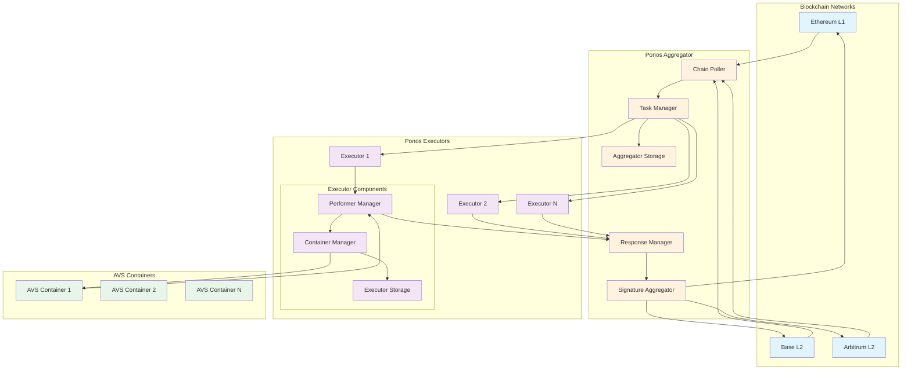
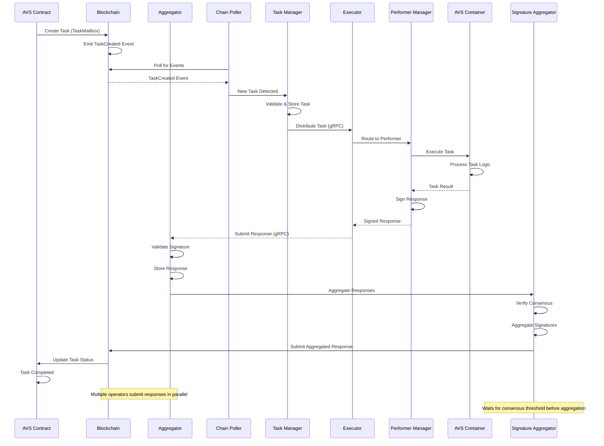

# Ponos Overview

Ponos is a comprehensive framework for building and operating EigenLayer AVS (Actively Validated Services) workloads. It provides a robust infrastructure for coordinating tasks across multiple blockchain networks, executing containerized workloads, and aggregating cryptographically signed results.

## Core Components

Ponos consists of two primary components that work together to enable decentralized task execution:

### 1. Aggregator
The Aggregator acts as the coordinator and orchestrator of the AVS system. It monitors multiple blockchain networks for tasks, distributes them to operators, collects and verifies responses, and submits aggregated results back to the blockchain.

**Key Responsibilities:**
- Multi-chain task monitoring and discovery
- Operator set management and coordination
- Response collection and verification
- Signature aggregation (BLS, ECDSA)
- Result submission to blockchain
- State persistence and recovery

### 2. Executor
The Executor runs on operator nodes and is responsible for executing AVS-specific workloads in isolated Docker containers. It receives tasks from the Aggregator, manages container lifecycle, and returns signed responses.

**Key Responsibilities:**
- Task execution in Docker containers
- Container lifecycle management
- Resource isolation and limits
- Response signing with operator keys
- State management for running tasks
- Health monitoring and reporting

## High-Level Architecture

## Sub-Components

### Aggregator Sub-Components

1. **Chain Poller**
   - Monitors configured blockchains for TaskCreated events
   - Manages block synchronization and reorg handling
   - Maintains last processed block for each chain

2. **Task Manager**
   - Validates and stores incoming tasks
   - Manages task lifecycle (pending → processing → completed)
   - Handles task distribution to operators

3. **Response Manager**
   - Collects operator responses via gRPC
   - Validates response signatures
   - Enforces response timeouts and SLAs

4. **Signature Aggregator**
   - Aggregates BLS signatures for efficiency
   - Verifies operator stakes meet consensus threshold
   - Prepares aggregated responses for submission

5. **Storage Layer**
   - Persists task state and chain sync progress
   - Supports in-memory and BadgerDB backends
   - Enables recovery after restarts

### Executor Sub-Components

1. **Performer Manager**
   - Manages AVS performer lifecycle
   - Routes tasks to appropriate containers
   - Handles response collection from containers

2. **Container Manager**
   - Docker container lifecycle management
   - Resource isolation and limits enforcement
   - Health monitoring and restart policies

3. **Signing Module**
   - Signs responses with operator keys
   - Supports multiple signature schemes (ECDSA, BLS)
   - Secure key management

4. **Storage Layer**
   - Tracks in-flight tasks
   - Stores performer state
   - Manages deployment information

## Task Flow Process

The following diagram illustrates the complete lifecycle of a task from creation to completion:

## Key Features

### Multi-Chain Support
- Simultaneous monitoring of multiple EVM chains
- Chain-specific configuration (confirmations, polling intervals)
- Unified task processing across L1 and L2 networks

### Flexible Execution Model
- Docker-based isolation for AVS workloads
- Support for various container types (server, one-off)
- Resource limits and GPU support

### Cryptographic Security
- Multiple signature scheme support (ECDSA, BLS)
- Secure key management
- Threshold-based consensus

### High Availability
- Persistent state storage
- Graceful recovery after restarts
- Concurrent task processing

### Production Ready
- Comprehensive metrics and monitoring
- Structured logging
- Health checks and alerting
- Performance optimization

## Deployment Models

### Standalone Deployment
- Single aggregator instance
- Multiple executor instances (one per operator)
- Suitable for single AVS operations

### Multi-AVS Deployment
- Shared aggregator for multiple AVSs
- Executors configured with multiple AVS containers
- Efficient resource utilization

### High Availability Deployment
- Active-passive aggregator configuration
- Load-balanced executor fleet
- Distributed storage backend

## Integration Points

### Smart Contract Integration
- TaskMailbox contract for task creation
- AVS-specific contracts for business logic
- EigenLayer middleware for operator management

### Operator Integration
- Standard gRPC interface for communication
- Flexible authentication mechanisms
- Metrics and monitoring endpoints

### AVS Developer Integration
- Simple container interface
- Environment variable configuration
- Standard logging and error handling

## Getting Started

To deploy Ponos for your AVS:

1. Deploy TaskMailbox contracts on target chains
2. Configure and deploy the Aggregator
3. Operators deploy Executors with AVS containers
4. Monitor task flow and system health

For detailed setup instructions, see the [Configuration Guides](./config/) and [Deployment Guide](./guides/deployment.md).